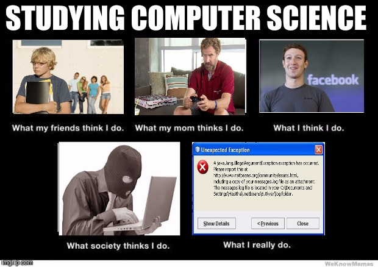

<div class="ui large rounded images">
  
</div>

  This project was my first program i made in java that incorporated the use of user input. Although this program seems so simple, this project introduced my friend into how computers work. By using this program I was able to explain the syntax on how programming languages work in java, how I code, in a fun an interactive way.

  This is the code to the first program I ever made that wasn't an assignment and i wanted to explain how computer science coding works to a non-computer science major.

```
import java.util.Scanner;

public class TeyanniProgram{

   public static void main (String [] args){
   
   String animal = "";
   String color = "";
   String verb = "";
   String place = "";
   String food = "";
   
   Scanner userIn = new Scanner(System.in);
   
   System.out.println("Enter a animal");
   animal = userIn.nextLine();
   System.out.println("Enter a color");
   color = userIn.nextLine();
   System.out.println("Enter a verb");
   verb = userIn.nextLine();
   System.out.println("Enter a place");
   place = userIn.nextLine();
   System.out.println("Enter a food");
   food = userIn.nextLine();
   
   System.out.println("A " + color + " " + animal + " " + verb + " to go to " + place + " to eat " + food);
   
   
   
   }
}
```

This project asks the user to input animal, color, verb, respectively, and outputs a sentence using those words you just used.


You can learn more about java on [JAVA API](https://docs.oracle.com/javase/7/docs/api/).

