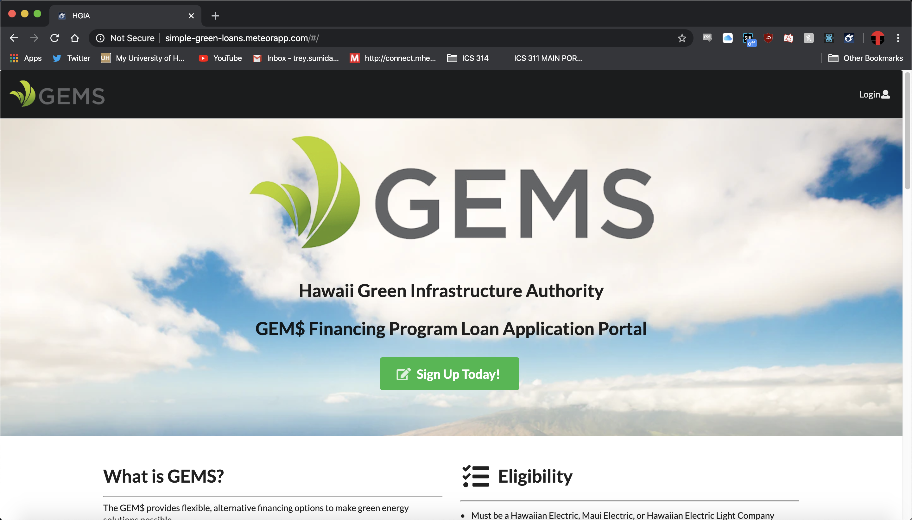
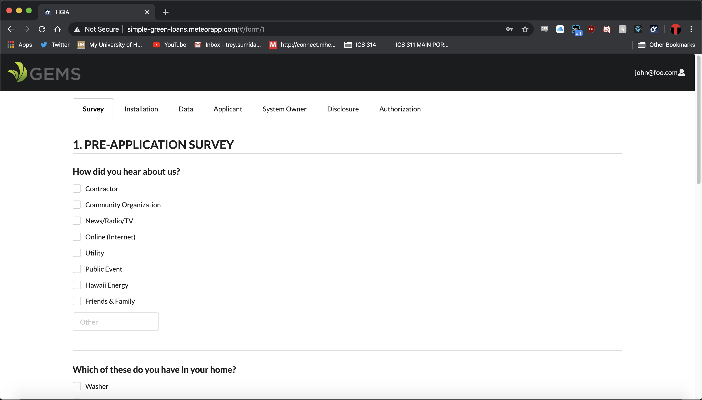
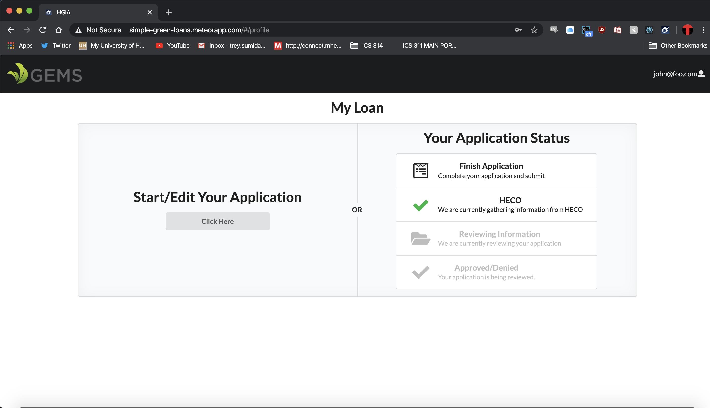

## **Overview**
[Simple Green Loans](http://simple-green-loans.meteorapp.com/#/) is a website that was created by [Wiley Bui](https://wileybui.github.io/), [Arslan Rakhmankulov](https://github.com/arslan-r), [Ryota Seki](https://github.com/ryotabs
), [Brody Uehara](https://github.com/brodyu) and [I](https://trey-sumida.github.io/). For [HACC
 2019](http://hacc.hawaii.gov/) we chose to take on the
 [GEM$ Program](https://gems.hawaii.gov/) challenge
 that was given which was to redesign the loan application website for GEM$ as it was outdated and not user
  friendly to both the applicants and the staff at GEM$. We did not place at the HACC, but it was a good experience
   and gave us a jumpstart to our final project for ICS 314 since after the HACC was over, we continued to work on the
   website as our final
   project
   for ICS 314. The old loan application was a long pdf file that the applicants would have to fill out which was
    daunting. The GEM$ staff would then have to manually copy over the information given on the pdf to an excel file
     for their records. Our newly redesigned website makes filling out the application easier, as we broke down the
      pdf into separate sections, which gives the user the ability to save where they are at and come back to it. On
       the admin side, a simple click of a button will download an excel file with the given information from the user.
       

## **Contribution**
For this project, I worked mainly on the front end user interface of the application. I designed the profile page for
 applicants, which included a status bar of what stage of the application process they are at. On the admin side, I
  helped create the page that allows admins to choose which users to send a reminder email to if they have not
   completed the application. 
   
   
   
## **What I Learned**
Working on this project I learned how to work in a larger group of people to develop an application, and how
 important project management is when working in a larger group. I am also now more comfortable with website
  development, and if I ever need to create one quickly for any reason, I am confident I would be able to do. 
  
## **Links**
- [Github Project Page](https://github.com/green-loan-portal/simple-green-loans)
- [Project Homepage](https://green-loan-portal.github.io/#overview)