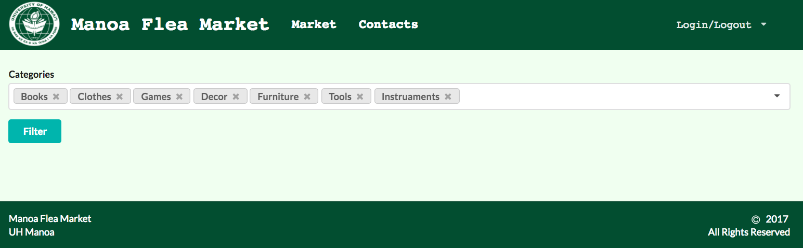
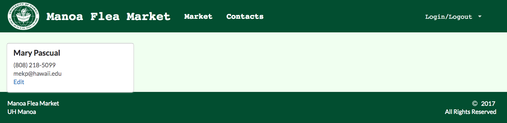
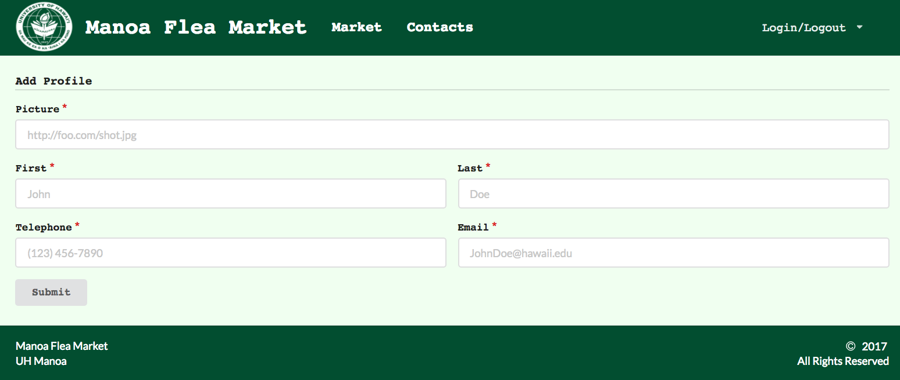
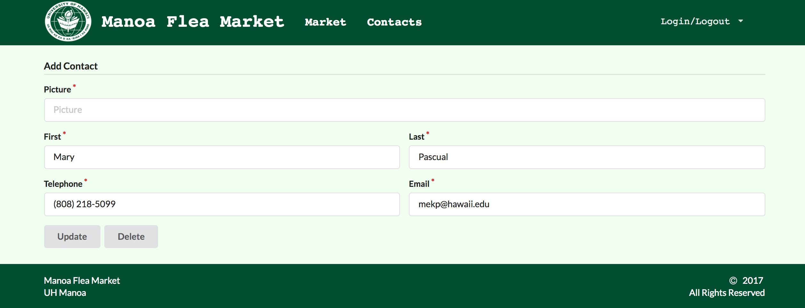

## About Manoa Flea Market

The Manoa Flea Market is a Meteor application that will offer UHM students a chance to buy or sell student-related goods and services. Similar to Craigslist, this application will:

* Have students login with their UH credentials to access the system
* Connect buyers and sellers through UH credentials
* Items and services offered on this site will be geared specifically towards UHM students

To learn more, visit the [Manoa Flea Market Homepage](https://manoa-flea-market.github.io).

## My Contributions

For this project, I worked with my classmates, Mary Pascual and Erik Huang. For the first milestone, we had to create mockup pages of our website. We each creted our own mockup pages before we came together and collaborated with each other. We realized that by ourselves, we came up with good ideas, so we took a little bit of each others code to create a mockup we all agreed on. 

During the second milestone, we started to do our own thing. The main goal of milourestone 2 was to start implementing our databases, so my first task was to create the databases so that my groupmates could start their portion of the project. Following the [Bowfolio](https://bowfolio.github.io) code as a guide, I created a CategoryCollection, ItemCollection, and ContactCollection. I also continued working on fixing our application's ovrall look, such as the homepage and the footer. 

For the last milestone, the goal was to finish our application's functionality and make finishing touches on the look of our application. In this milestone, my main task was to work on the add item and edit item form. I also redid the landing page and our top menu. 

## My Take Away

## Manoa Flea Market Preview

The following screenshots are the mockup of several pages available on the application, starting from the landing page. For a more in-depth explanation, please visit the [Manoa Flea Market Homepage](https://manoa-flea-market.github.io).

## Important Links

A demo of the Manoa Flea Market can be viewed [here](https://manoa-flea-market.meteorapp.com)::
All the information about the application can be viewed on the [Manoa Flea Market Homepage](https://manoa-flea-market.github.io)::
The source code for this application can be viewed on its [Github Page](https://github.com/manoa-flea-market/manoa-flea-market)::
