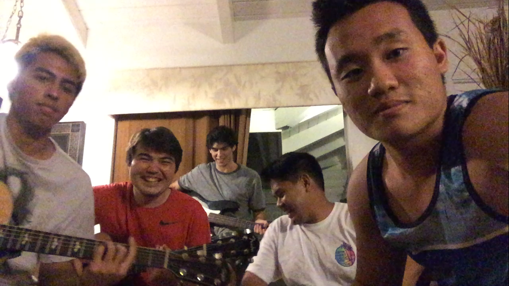

  

Out of all of the “projects” that I have completed in my life, this was definitely the most fun. Me and my friends have all been playing an instrument for a few years; however, none of us had really played together for some reason. So we started having a bunch of jam seshes together and it turned out to be something we all enjoyed doing. We would have a jam sesh nearly every day to try and learn a whole bunch of songs and try to perfect ones we had already learned. Then one of our friends (the drummer, Matthew) told us that he was going to have a graduation party and wanted us to perform on stage during an intermission. From that point on, we were official. Mattchew and da boiz had become a reality. We then practiced songs for a while (We never made an original song sadly, we just covered mainstream ones), until it was the morning of the performance.

We had 7 members total, however only 5 were in the picture above. I was the acoustic guitar player. There was also an electric, saxophone, keyboard, bass, drums, and of course the lead singer. When we performed at the venue, it was like performing on a stage with all eyes focused on us. I had never performed in public before so I was extremely nervous but being up there with my friends was a surreal feeling that was one of the greatest moments of my life. Unfortunately, there were some sound errors, as we were using different kinds of amps and a PA system, which we hadn’t used before and we didn’t get to practice at the venue, so there were some mistakes in the performance, and I’m really melancholic that I don’t have any pictures of it I’m gonna need to get those from Matthew!

Ultimately, this project help me become not only a better person, but a better teammate. This was one of the very few times I felt I was a cog in a system, I needed to be on point so that the whole thing could run smoothly. It taught me that I needed to practice and keep my skills sharp so that I wouldn’t mess up and have the system run erroneously. It taught me how to collaborate with 6 other people to create something that we could all agree was beautiful. Sitting for hours trying to make sure everything was heard, having to mix and match chords and keys around until we got the sound we wanted. Conclusively, it was a project that taught me to be a better teammate, and a better person by testing my ability to work with others, test my creative abilities, and push myself and others to be the best we could be.
