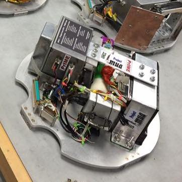
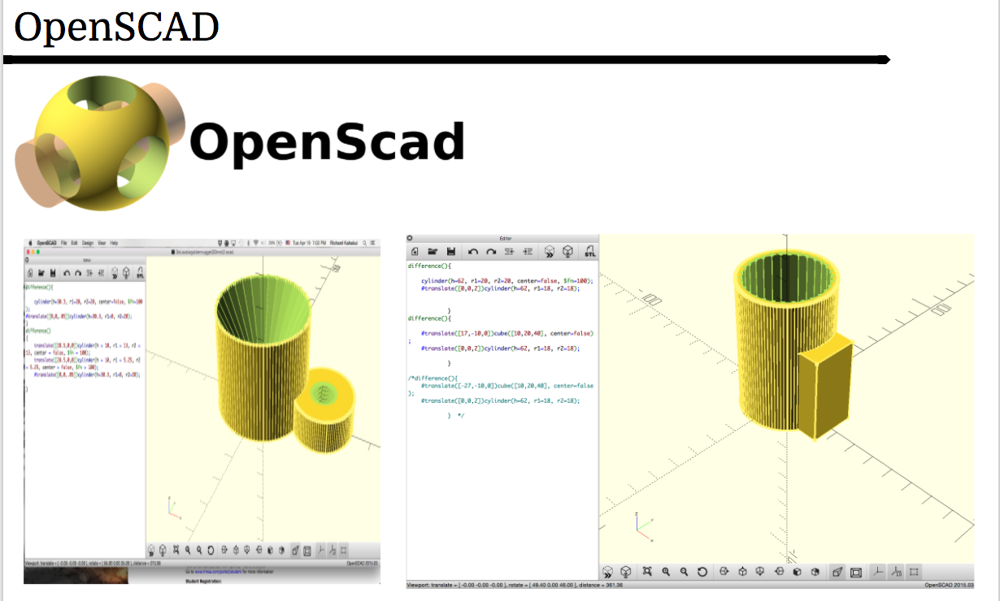

  
  

Rocksat X is a multi institutional opportunity for teams of students to design and build their own experimental payload to be cunducted in space. Our team, Project Imua which is comprised of four different University of Hawaii Community Colleges, developed PrIME which stands for Project Imua Multiple Experiments because of the four campuses and their contribution to the overall experimental payload. 

My team developed the Super Simple Sublimation Rocket, or ScubeR for short - pronounced "scubber". The purpose of ScubeR is to determine if a reasonable amount of thrust is achieved through sublimation in space in order to reduce dependance on oxygen as a fuel sorce for thrust when astronauts work outside of the space station. The design of the rocket was all made in our lab using our 3D printer the Taz Bot along side the CURA software. However, since we didn't have an interactive design software like AutoCad or Solidworks, we instead used OpenScad to design our rocket. This meant manually programming the coordinates and dimentions of the rocket parts - (I highly recommend against openscad unless you plan to spend many hours with buggy and tidious adjustments to a simple object). The rocket was printed in four parts to reduce stress on the 3D printer and connected using ABS plastic adhesive since our rocket was printed with ABS plastic.

Additionally my team was also responsible for designing a way to eject our little ScubeR from the payload which is attached to the large main rocket holding all the different projects. We were able to do this by programming a stepper motor such that it released ScubeR at a rate of a couple centimeters per second. This was done in Python using a Raspberry Pi.

You can learn more at [RockSat-X Home Page 2016](http://spacegrant.colorado.edu/rs-x-home/rocksat-x-2016-home) and the [UH New's](http://www.hawaii.edu/news/2016/08/17/project-imua-payload-successfully-launched/).

