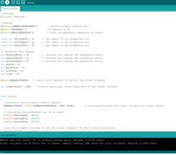

Real life motion such as heart beats and breathing can be constructed through robotic implementations. Genuine humanoid movement is what we seek when testing motion sensing. Dynamic movement such as alternating breathing patterns is the essential base for our system. The breathing motion system is designed using linear actuators and a connected arduino to control the robotic movement.

This central goal was further broken down into several major sub-goals: 1) To create a portable and testable chest model that could be programmed to simulate different patterns. 2) To create a program that produces precise patterns that replicate human breathing patterns. 3) To use doppler radar sensors to acquire data and develop algorithms to determine what breathing patterns we see. 

I myself organized the team structure and the design of the project, with the help of my advisor, Dr. Lubecke. I was in charge of building the inner works of the phantom breather, from wiring all the materials together, to designing the program structure and model patterns. 

My partner, Paul Subia, was in charge of designing the robot, to be as secure and compact as possible. Choosing how the robotic phantom would display, as well as how we would access the components were part of the task. Solving the issue of portability was another task which was accomplished during the building process of this project.

We were both in charge of initial research, design and material alternatives. Once we had the our parts completed, we had to accomplish testing on the robot and analyzing the signal output. 

Overall, we achieved a majority of our goals for the semester. Our major blunders were in implementing the more complex features like remote control access and algorithms that could determine a person’s well-being based off their breathing pattern. These problems will be tackled by project members in the near future. 

