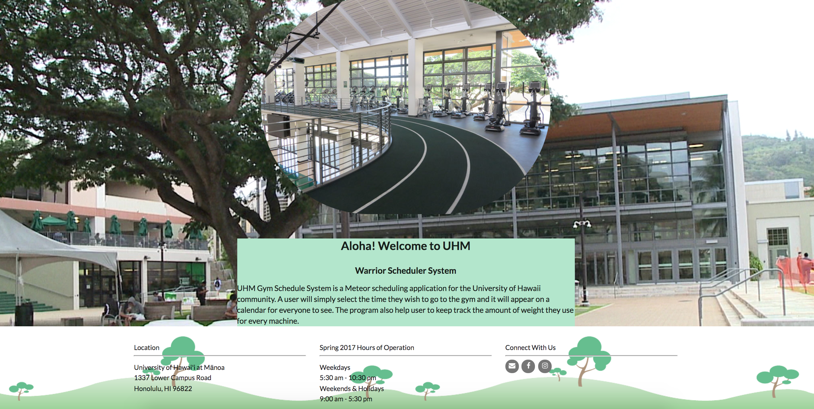
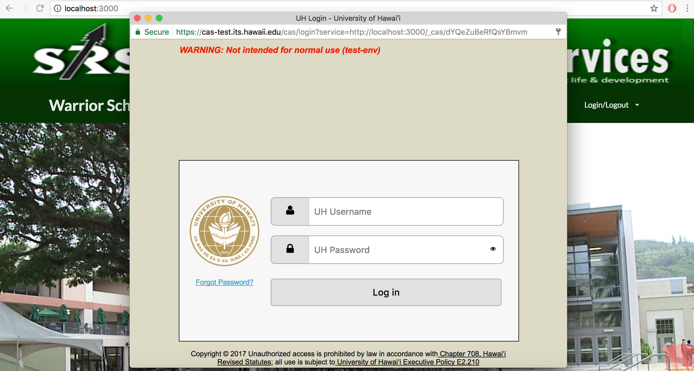
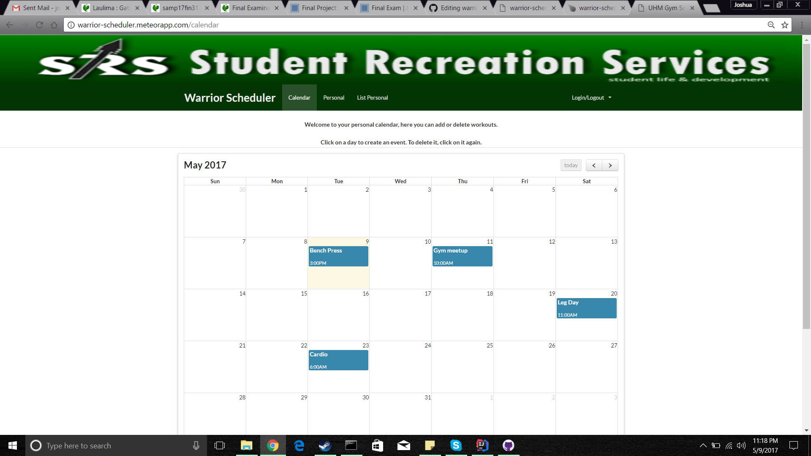

  
  
  

UHM Gym Scheduler is a Web App I developed in ICS 314 with a team of three people. We build this app using Meteor and it 
provide a platform for the University of Hawaii community. User will simply select the time they wish to go to the Gym and 
it will appear on a calendar for everyone to see. This App also help user to keep track the amount of weight they use for
every machine. To use our app, you must have your UH account to login. after logging in, all the functions such as calendar,
add user and list user will be available for you. You can use calendar function to a gym event and workouts, you can also use
personal page to fill out your personal information.

My contribution to the project was implemented the CAS login and Home page, I also helped my teammates when they need helps.
one of the challenges for this project was implemented the CAS login function. when I implement the CAS login, I replaced the
wrong file, and this make the app crashed. 

I learned a lot from the project, I learned how to work with a team using github to build a web app, and I learned more about
HTML, JavaScirpt and Meteor which are helpful for my future career.

Here is our [project website](https://skylite-manoa.github.io/warrior-scheduler/).
