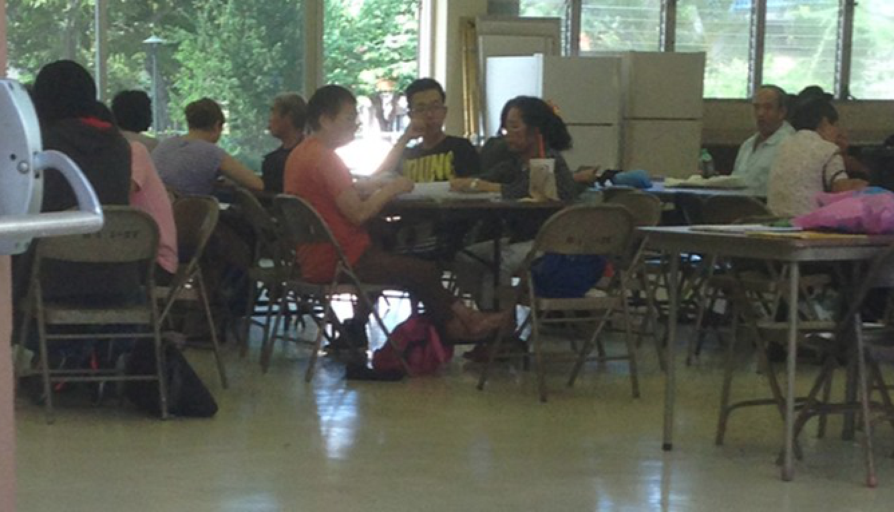

What is project SHINE? SHINE is an acronym for Students Helping in Naturalization of Elder. I started this project when I
 a freashmen in KCC. This is a great opportunity to help Chinese immigrants study for the American citizenship test, help them pass the test to become a citizen. 
 
Program Goals:

To tutor immigrants of Honolulu communities - to help them learn English and pass their citizenship exams . . . thus maintaining their quality-of-life.
To promote inter-ethnic agency, community, and university collaboration.
To raise the consciousness of college students concerning government policies toward immigrants and the "immigrant experience".
To promote and facilitate the empowerment of immigrants in Hawai'i.

Through this project I gained some experience and something connected to my life. for example, as a teenager, I learned that I
should respect senior, because most of the learner are old people. also, this also improve my people skills.
 
Source: <a href="https://www.chaminade.edu/service-learning/project-shine"><i class="large github icon"></i>Project SHINE</a>
