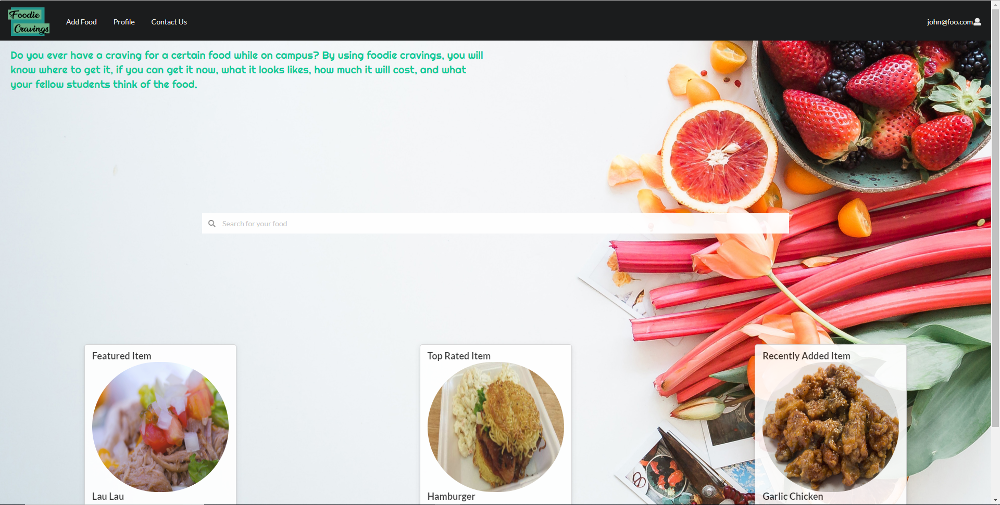

  

## Our Plan
  Our plan was to create an easy to use, informal website directed towards students attending UH Manoa to gain more information on the locations of their favorite entrees. Users could add reviews to the website along with pictures, rating, and where to buy the entrees. Then other users may search up reviewed entrees and make comments or add additional ratings to the existing entree. 
  
## My experience working with a team
  We divided the entire project in 3 subsections called milestones. In each of these subsections, we were each given a set of issues that we had to complete within a given time period. In the first milestone, my job was to create the home page, implement a way that users may report bugs to admins, deploy the project on Meteor, and create a project home page [foodiecravings.github.io](https://foodiecravings.github.io/), where my team or others had access to our project, source code, and deployed website. During this time, I learned it's best to get a head start on the starting development and getting all the pages done with a layout on how we want to showcase our website. This made it easy for my team to add functionality on specific pages and set the foundation and what we needed to do next. 
  
  For milestone 2, the main goal of this was adding functionality to our website and the most troubling. My main issues for this milestone was to add in a way where users may make a profile and add personal information to display to others. However, certain tasks of this website were quite difficult to handle alone. After I finished with my issues, I was also able to help my team implement a search bar. Having little to no experience with JavaScript React, we found it quite difficult when adding in the functionality that we wanted. We would spend hours and hours on a task that wasn't working in our favor. From this experience, I did learn to step away from my work and to clear my mind. When I was working on a search bar to filter through our data collection correctly. I was too deep and invested in a specific path on how to solve the problem when, it was best to go a whole different direction. Every time I would take a breather and do something unrelated to my issue, I would come back and solve it within 10 minutes. This would happen on every problem I worked on for more than an hour. 
  
  Finally, the last milestone of our website was to clean up the project, finish and fix existing functionalities added in milestone 3. Although the time constraint for this project meant we had to compromise on some things we wanted to add to the website, it gave us a chance to learn what it was like working with a team. From this experience I learned it is necessary to have a group leader that decides what to add, what to cut, and to help us stay on track on what needed to be done. I believe we would have gotten a lot more done this way because we were too focused on what the project meant to the team, rather than what the project would mean to the users.

