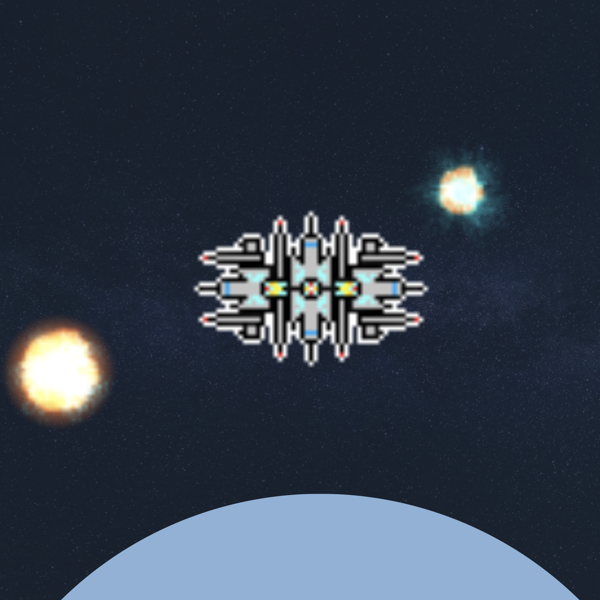

<div class="ui small rounded images">
  
  
</div>

The objective of our game is to shoot asteroids while avoiding any collisions. In order to win the game, you must face the final boss and destroy it.

In this project, I was in charge of creating the asteroids that the player would fire at as well as the Big Boss that would show up in the final round. The asteroids had three different sizes, the larger the asteroid, the more shots it took to destroy it. In order to create the asteroid, we needed to spawn it so I made use of a vector to create them and it would spawn from every side of the screen. To make the game more difficult, as more asteroids were destroyed, the speed would increase. For the final boss that the player had to face, it moved slowly from the top of the screen. An HP bar was also displayed and slowly decreased as the player shot at the boss. When you face the final boss and completely kill it, the game has been won.


```js
byte ADCRead(byte ch)
{
    word value;
    ADC1SC1 = ch;
    while (ADC1SC1_COCO != 1)
    {   // wait until ADC conversion is completed   
    }
    return ADC1RL;  // lower 8-bit value out of 10-bit data from the ADC
}
```

