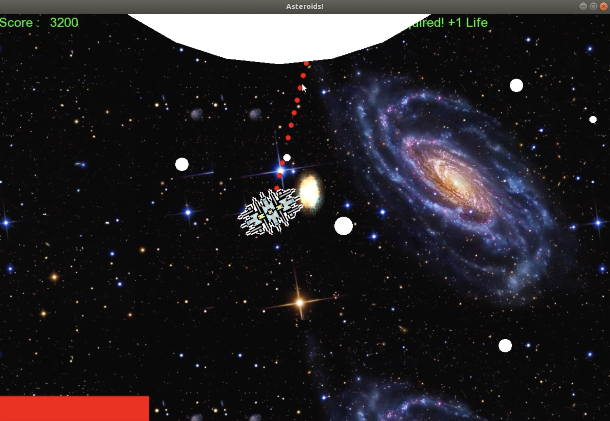

For the final project of my EE205 course, we were given the opportunity to create our own project that utilized object-oriented programming. My team decided that we wanted to create a game similar to what we've played before online, which was an asteroid survival game. The objective of our game is to shoot asteroids while avoiding any collisions. In order to win the game, you must face the final boss and destroy it.

In this project, I was in charge of creating the asteroids that the player would fire at as well as the Big Boss that would show up in the final round. The asteroids had three different sizes, the larger the asteroid, the more shots it took to destroy it. In order to create the asteroid, we needed to spawn it so I made use of a vector to create them and it would spawn from every side of the screen. To make the game more difficult, as more asteroids were destroyed, the speed would increase. For the final boss that the player had to face, it moved slowly from the top of the screen. An HP bar was also displayed and slowly decreased as the player shot at the boss. When you face the final boss and completely kill it, the game has been won.

This project was one of the biggest coding projects I have every done and it was a great experience for me. It took a lot of group meetings, research, self-learning, and time management to be able to get it done. It also taught me about the importance of passion and drive to be able come up with new ideas, improvements, and features to our game so that we could make it enjoyable and usable for the player.
