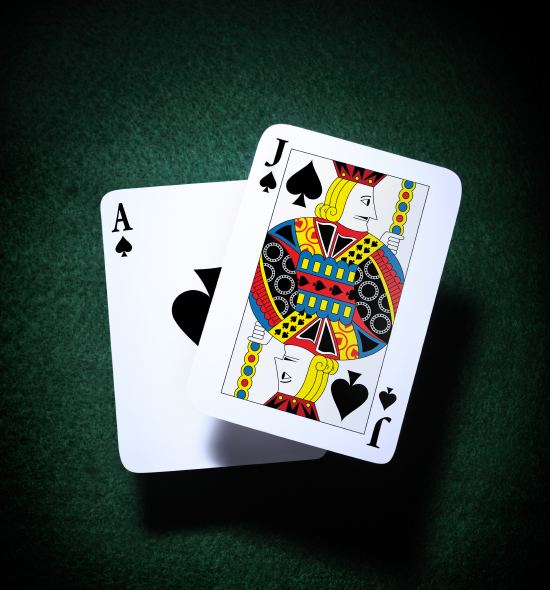
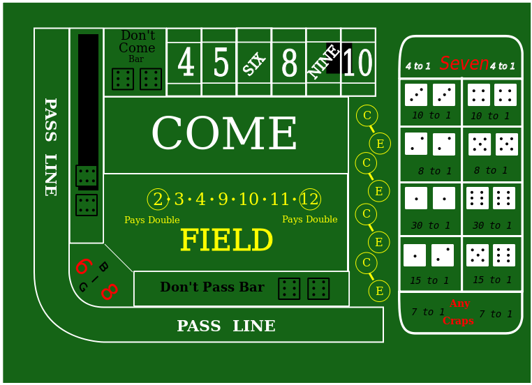
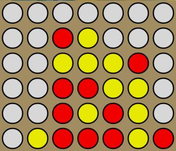

  
  
  

As a three man team, we were tasked to design several different projects. For our first project, we designed a blackjack game. Blackjack is a card game with at least a dealer and a player where the players goal is to beat the total value of the dealer's without exceeding a value greater than 21. The rules can further be seen at the [Blackjack Overview by Bycicle](http://www.bicyclecards.com/how-to-play/blackjack/). This helped us to become more familiar with simple programming basics behind any language like variables, functions and loops. As a simplified version we only designed the game assuming one 52 card deck and no bid tracking. 

Another project in this series was to design a simplified version of the game Craps. Detailed rules and instructions can be found at [Craps: Wikipedia](https://en.wikipedia.org/wiki/Craps).  Without any of the actual crazy bidding options, we simply designed craps with three general bet options of pass line, field and don't pass. The main goal was to be able to run many different functions and keeping track of different moments of the playing game while maintaining organization throughout your code.

The last of the three games was of our own choice, Connect Four. Connect four is a two-dimensional game, in which players take turns dropping a designated peice into a stack where the first player to receive a four in a vertical, horizontal or diagonal line wins. The first point of this game was to focus on arrays where order matters and to operate the game in a type of graphic user interface. We managed to display a connect four grid in the console and end the game when the first person with a Connect-Four has won. 
