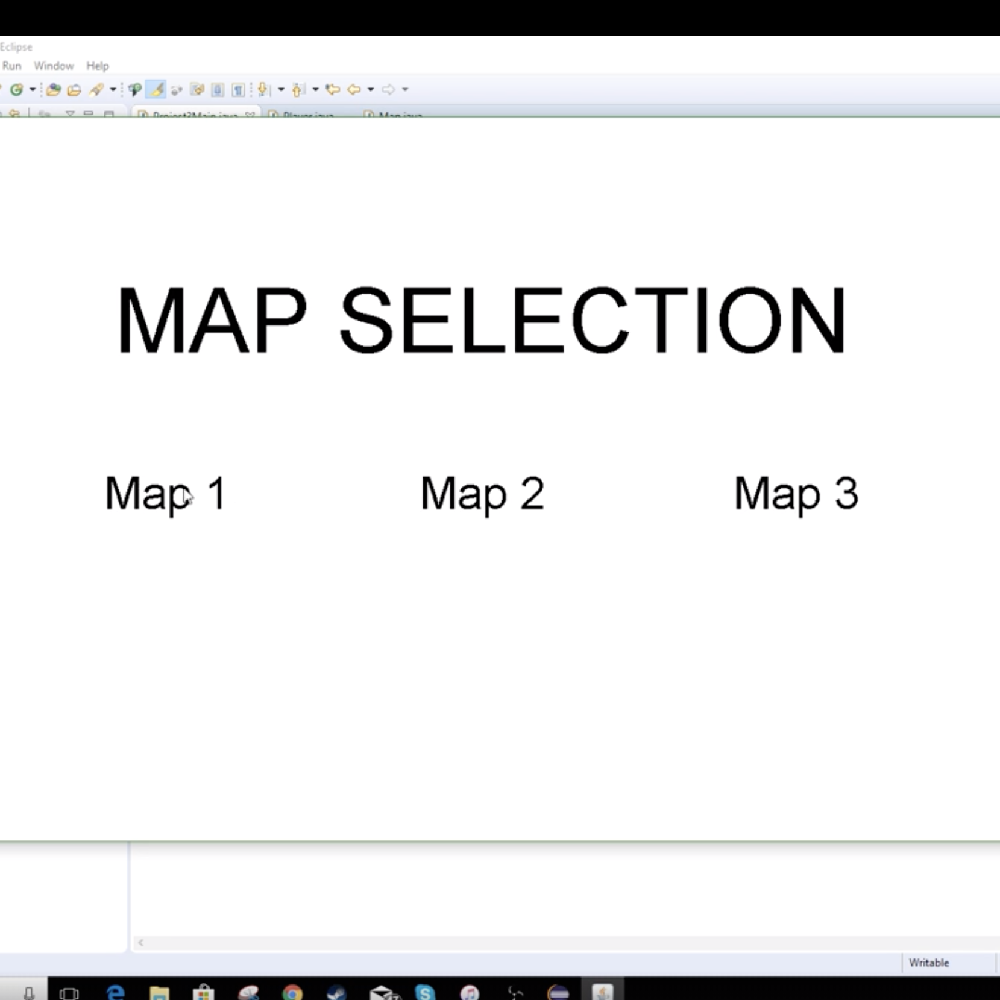
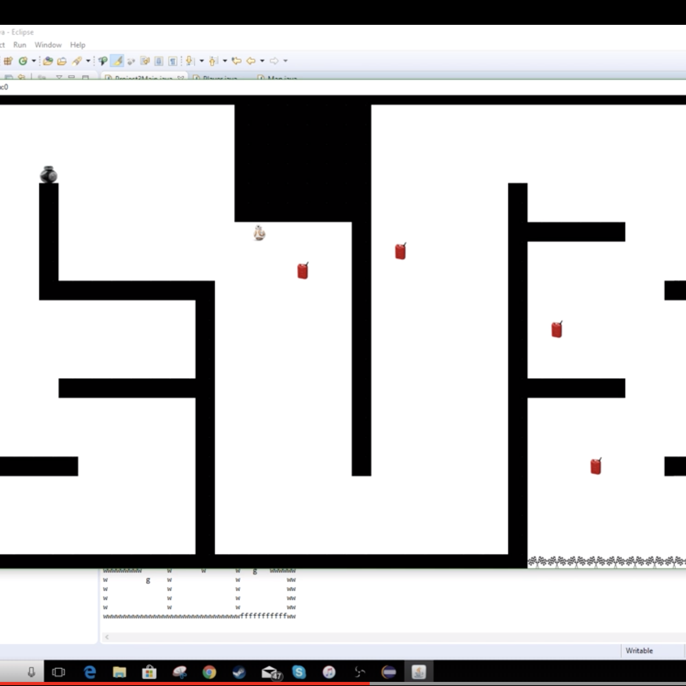

ICS 111 was the first coding class I took. I had no prior experience in coding before. The closest thing to coding I did was change my settings with the console on CS:GO, so ICS 111, and just coding in general was a whole new subject for me. We coded in java, using the eclipse IDE. We had a total of 3 projects for the class, with the last one being a group project. For the final project, I worked with 2 other people to create a 2D racing game, which you can see [here](https://youtu.be/oKqda8ySnhI). 

  

We decided that each of us would be in charge of a different class. I was in charge of creating the map class, which can be found in the link below. It being all of our first year taking a coding class, we were unaware of websites that would make it easier to share our code with one another. We would constantly send emails with our updated class to see if it works properly with the other persons. When it got too frustrating, we eventually found times where we could be in the same area and work on it together. This helped with communication, and it was also helpful to bounce ideas for our game off one another. 

This project was my first group coding project, and was a great learning experience. Working in a group taught me to see code from another persons perspective and not just my own. Many times, there are multiple ways to get the same result, so bouncing code off one another helped me see how others try to solve the same problem. Working in this group also gave me experience in dealing with a difficult partner, as I would try to give suggestions for how to write certain functions but he would just brush it off. 

[Project Code](https://github.com/trey-sumida/ics111racing)
