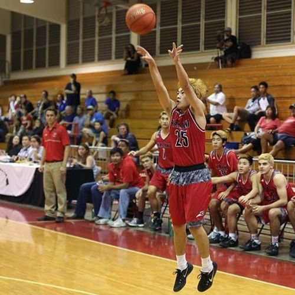

  
  

In high school, I played basketball all four years. The first two years I spent on junior varsity, while my last two years I spent on varsity. There were a lot of ups and downs throughout my career, and each one has made me a better person today. In my freshman year I earned a starting spot on the team, beating out a few sophmores. This was fool's gold however, as it made me think I was better than I really was. It wasn't until my first game where I struggled, it humbled me and brought me back down to earth. This made me work harder, pushing myself in practice and attending any extra training the coach provided. Freshman year would end with us losing in the championship game. 

Sophmore year was rough, as during tryouts I broke my pinky finger and would have to sit out for almost two months. In that time, I started to learn how to be a leader off the court. Even though I was unable to participate in practice, I still showed up and encouraged my teammates from the side. It helped me see that the teams success was more important than any individual success. Eventually I was cleared to play, and again we made it to the championship game but lost.

Junior year I moved up to varsity, but we struggled to blend as a team since a lot of players had just transferred in that year. With the talent we had, we were able to make it to the championship game once again, but lost on a buzzer beater three-pointer. Senior year is where all the pain and suffering of losing in the championship game would pay off. The core of our team had been together since freshman year, and we were motivated to win the championship as it was our final year. We were not the best team on paper, but we trusted in one another and played as a team. There was no one star, and each victory was a team win. This held true in the championship game, when we finally won and brought home a championship to Kalani.

My high school basketball career helped shape me into the person I am today. I had coaches who cared about me not only on the court, but off the court as well. I learned about work ethic, and what it takes to be great. In my senior year, I was given the honor of being a team captain. I was always more of a lead by example type of leader, but as the season progressed I started to gain a voice and get outside of my comfort zone. I built lasting relationships with each of my teammates, as every win and every loss brought us closer together, culminating in a championship.

