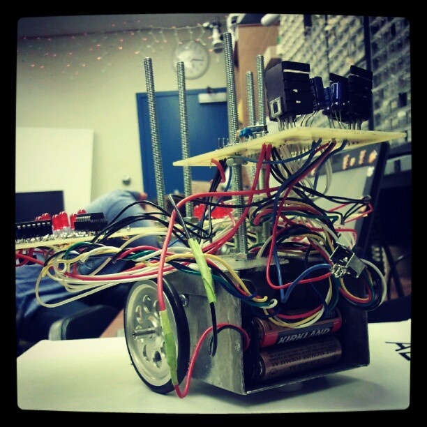
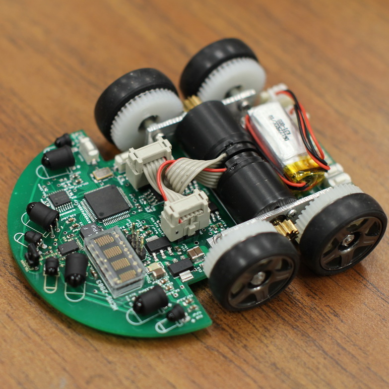
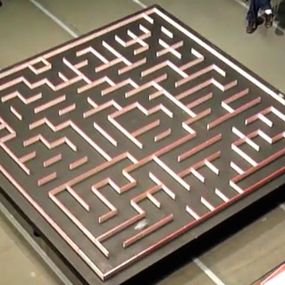
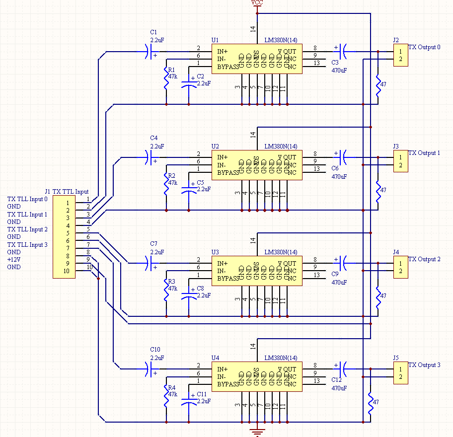

  
  
  
  

Address book is a project for ICS212 at the University of Hawaii at Manoa.  This project is done by C++. This address book contains the functions of adding new contact, modifying a contact, printing a contact or all contacts, deleting a contact, and reversing all contacts.  The information that each contact gather is its full name, address, the year of birth, and tellphone number.  If users modify and there are two or more contacts that have the same name, this program modifies all of them. It is the same thing for deleting.  There is a feedback for the each step and it confirms the users what they are doing.

I did this project by myself.  I used a linked list for this address book and for keeping all the records.  I had an addrecord function, a printrecord functino, a printall function, a modifyrecord function, deleterecord function and deleteall function.  Additionally, there were readfile and writefile function so that all the records would write on a file.  The records will keep in the file so that even the users quit the program and start again, they can continue from wherever they finished last time.

You can find the code for this project from [GitHub]().

