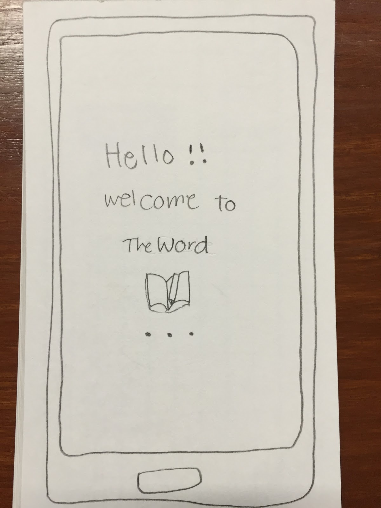
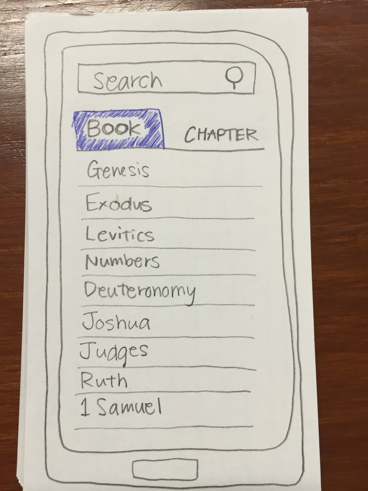
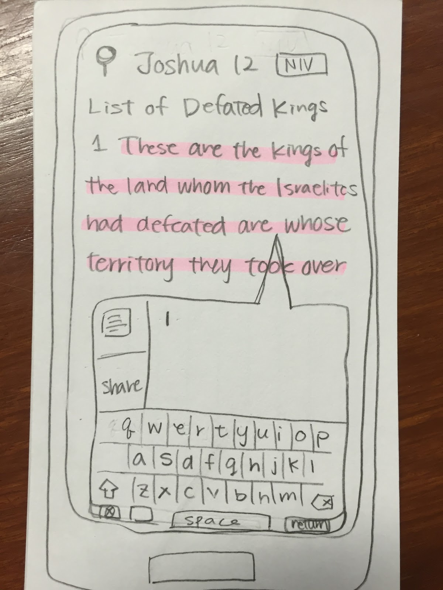

  
  
  

This project is about creating "any" things that involve any human interaction.  I did not need to make a program but need to think the concept, a target audience, a persona, a scope which is something that the project cannot do, a scenario and testing.  This project's goal is not being able to create an app but is being able to create a project with clear description and concept, and to think the target audience and make a persona with the low-fidelity prototype. 

I decided to think about a bible app which allowed users to highlight, share with friends via a social network, search related verse(s) from the Bible, take a note, and share ideas with other users of the app.  Since this app will be on some devices such as smartphone or tablet, my target audience would be from high school students to mid-40 because they are familiar with those devices and would like the convenience of the app. I made all the description and other details, as well as a low-fidelity prototype with some methods called Wizard of Oz and sketch-boarding. I tested this project with my friend, and there were several issues which I would be able to improve this app.

Through this project, I found that testing by a user who did not know about it with a clear description is very important.  Because of the test, I could point out what to improve and have a different perspective of the project to add on.  When I test it by myself, I know how it supposed to work so easily miss a section that is unclear to the users.  On the other hand, a tester can find many parts that I missed.  Additionally, thinking about the target audience makes more efficient on creating projects.  There are no such products that can be used by *anyone*.  Therefore, it woudl be nice to focus on the target audience, how they are going to use it, when they will interact with it and so on.

You can learn more at the [dropbox](https://www.dropbox.com/s/3ni11qx8upnt1r7/FinalPresentation.mov?dl=0).

