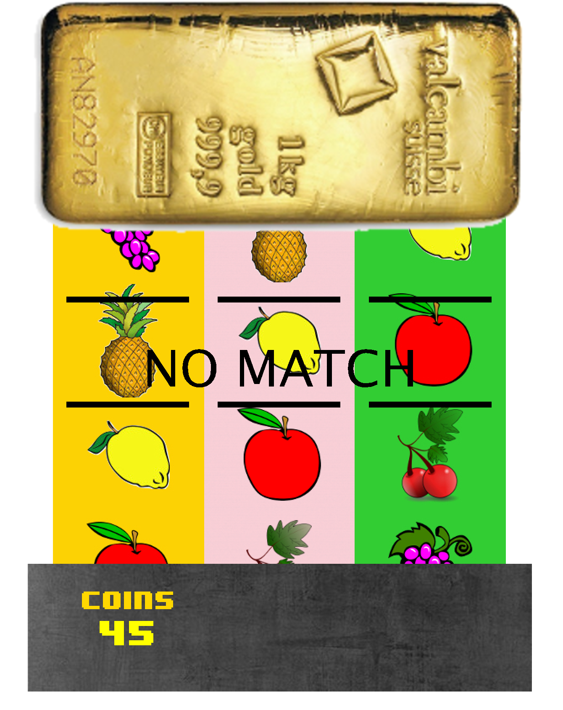
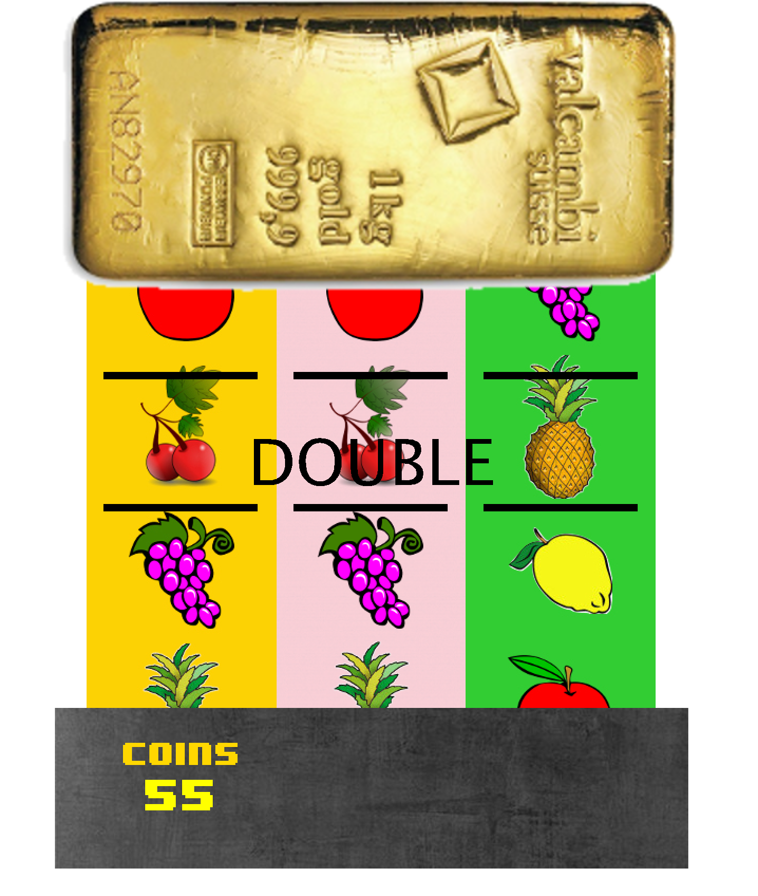

<div class="ui small rounded images">
  
  
</div>

## INTRODUCTION:
This was a project I had a lot of fun in thinking up, designing, and ultimately programming in my first Computer Science class. It is a simple and straightforward slot machine. Users start off with an alloted amount of coins, which value gets added or subtracted to based on what combination of fruits they roll. I thought my project was unique, especially when compared to my peers', because instead of implementing fighting or shooting type games, I designed something more pattern/application-based.

## HOW DOES IT WORK?
The main coding framework behind this is known as the *finite state machine*. A finite state machine is a very simple, yet very effective coding techinque that is applicable in Computer Science as well as Engineering. Here, I designated the various "states" of my slot machine as the different logical steps one would take in interacting with the machine in real life. For example: starting the machine, spinning the rolls, obtaining coins, etc. Between the start and end states, nothing is static, and can be interchanged indefinitely until a user runs out of coins to play.

## CONCLUDING:
This fun project taught me the power of certain coding techniques. The idea that there is a lot more to a project underneath the graphics code-wise was also enforced. It also gave me more experience with working through the different stages of development of a project: going from a simple idea to an actual working device/software/etc. I look forward to programming something similar in the future!

Here is some finite state code that illustrates exactly how I move through states, for those interested:

```js
switch(slotState){

		case START:
			Start.msg = "Press 'S' to SPIN";
			
			if (EZInteraction.wasKeyPressed('s')){
				slotState = SPIN;
			}
			break;

		case SPIN:
			
			Start.msg = "";
			TEXT.msg = "";
			
			myTiles.get(0).translateBy(0, +5);
			myTiles.get(1).translateBy(0, +5);
			myTiles.get(2).translateBy(0, +5);
			myTiles.get(3).translateBy(0, +5);
			myTiles.get(4).translateBy(0, +5);

			myTiles.get(5).translateBy(0, +10);
			myTiles.get(6).translateBy(0, +10);
			myTiles.get(7).translateBy(0, +10);
			myTiles.get(8).translateBy(0, +10);
			myTiles.get(9).translateBy(0, +10);

			myTiles.get(10).translateBy(0, +30);
			myTiles.get(11).translateBy(0, +30);
			myTiles.get(12).translateBy(0, +30);
			myTiles.get(13).translateBy(0, +30);
			myTiles.get(14).translateBy(0, +30);

			if (EZInteraction.wasKeyPressed('s')){
				slotState = ALIGN;
			}
			break;

		case ALIGN:
			if ((myTiles.get(0).getYCenter() % 136)!=0){
				myTiles.get(0).translateBy(0, 1);

			}
			if ((myTiles.get(1).getYCenter() % 136)!=0){
				myTiles.get(1).translateBy(0, 1);

			}
			if ((myTiles.get(2).getYCenter() % 136)!=0){
				myTiles.get(2).translateBy(0, 1);

			}
			if ((myTiles.get(3).getYCenter() % 136)!=0){
				myTiles.get(3).translateBy(0, 1);

			}
			if ((myTiles.get(4).getYCenter() % 136)!=0){
				myTiles.get(4).translateBy(0, 1);

			} //maybe change to 136 to fix bug, previously was 138
			if ((myTiles.get(5).getYCenter() % 136)!=0){
				myTiles.get(5).translateBy(0, 1);

			}
			if ((myTiles.get(6).getYCenter() % 136)!=0){
				myTiles.get(6).translateBy(0, 1);

			}
			if ((myTiles.get(7).getYCenter() % 136)!=0){
				myTiles.get(7).translateBy(0, 1);

			}
			if ((myTiles.get(8).getYCenter() % 136)!=0){
				myTiles.get(8).translateBy(0, 1);

			}
			if ((myTiles.get(9).getYCenter() % 136)!=0){
				myTiles.get(9).translateBy(0, 1);
				
				//end pink tiles

			}
			if ((myTiles.get(10).getYCenter() % 136)!=0){
				myTiles.get(10).translateBy(0, 1);

			}
			if ((myTiles.get(11).getYCenter() % 136)!=0){
				myTiles.get(11).translateBy(0, 1);

			}
			if ((myTiles.get(12).getYCenter() % 136)!=0){
				myTiles.get(12).translateBy(0, 1);

			}
			if ((myTiles.get(13).getYCenter() % 136)!=0){
				myTiles.get(13).translateBy(0, 1);

			}
			if ((myTiles.get(14).getYCenter() % 136)!=0){
				myTiles.get(14).translateBy(0, 1);

			}

			//Once all aligned
			if(myTiles.get(0).getYCenter() % 136==0 && myTiles.get(1).getYCenter() % 136==0 && 
					myTiles.get(2).getYCenter() % 136==0 && myTiles.get(3).getYCenter() % 136==0 && 
					myTiles.get(4).getYCenter() % 136==0 && myTiles.get(5).getYCenter() % 136==0 && 
					myTiles.get(6).getYCenter() % 136==0 && myTiles.get(7).getYCenter() % 136==0 && 
					myTiles.get(8).getYCenter() % 136==0 && myTiles.get(9).getYCenter() % 136==0 && 
					myTiles.get(10).getYCenter() % 136==0 && myTiles.get(11).getYCenter() % 136==0 && 
					myTiles.get(12).getYCenter() % 136==0 && myTiles.get(13).getYCenter() % 136==0 && 
					myTiles.get(14).getYCenter() % 136==0){

				//Add COIN state instead of STOP? and then COIN --> STOP?
				slotState = COIN;
			}

			break;
			
		case COIN:
			
			if (myTiles.get(0).isPointInElement(YellowX, YellowY)) {
				a = 1;
			}
			
			if (myTiles.get(1).isPointInElement(YellowX, YellowY)) {
				a = 2;
			}
			
			if (myTiles.get(2).isPointInElement(YellowX, YellowY)) {
				a = 3;
			}
			
			if (myTiles.get(3).isPointInElement(YellowX, YellowY)) {
				a = 4;
			}
			
			if (myTiles.get(4).isPointInElement(YellowX, YellowY)) {
				a = 5;	
			}
			
			if (myTiles.get(5).isPointInElement(PinkX, PinkY)) {
				b = 1;
			}
			
			if (myTiles.get(6).isPointInElement(PinkX, PinkY)) {
				b = 2;
			}
			
			if (myTiles.get(7).isPointInElement(PinkX, PinkY)) {
				b = 3;
			}
			
			if (myTiles.get(8).isPointInElement(PinkX, PinkY)) {
				b = 4;
			}
			
			if (myTiles.get(9).isPointInElement(PinkX, PinkY)) {
				b = 5;
			}
			
			if (myTiles.get(10).isPointInElement(GreenX, GreenY)) {
				c = 1;
			}
			
			if (myTiles.get(11).isPointInElement(GreenX, GreenY)) {
				c = 2;
			}
			
			if (myTiles.get(12).isPointInElement(GreenX, GreenY)) {
				c = 3;
			}
			
			if (myTiles.get(13).isPointInElement(GreenX, GreenY)) {
				c = 4;
			}
			
			if (myTiles.get(14).isPointInElement(GreenX, GreenY)) {
				c = 5;
			}

			while(true) {
				if (a == b && a == c)
				{
					System.out.println("TRIPLE, you have won $" + triple);
					
					Color c = new Color(255, 215, 0);
					Color b = new Color(0, 0, 0);
					
					
					CoinPurse += triple;
					CoinValueText.msg = ""+CoinPurse;
					
					//woohoo.play();
					
					TEXT.msg = "TRIPLE";
					
					slotState = LOAD;
				
					
				}
				else if (a == b || a == c || b == c)
				{
					System.out.println("DOUBLE, you have won $" + doub);
				
					CoinPurse += doub;
					CoinValueText.msg = ""+CoinPurse;
					
					//woohoo.play();
					
					TEXT.msg = "DOUBLE";
					
					slotState = LOAD;
				
				}
				else if (a != b && a != c && b != c)
				{
					System.out.println("You have won $0");
					
					CoinPurse -= Betcoin;
					CoinValueText.msg = ""+CoinPurse;
					
					//damn.play();
					
					TEXT.msg = "NO MATCH";
	
					slotState = LOAD;
				
						
				}
				
				break;
				
				}

		case LOAD:
			if (a == b && a == c)
			{
				
				TEXT.msg = "TRIPLE";
				if (EZInteraction.wasKeyPressed('s')){
					slotState = SPIN;
				}
				
			}
			else if (a == b || a == c || b == c)
			{
				
				TEXT.msg = "DOUBLE";
				if (EZInteraction.wasKeyPressed('s')){
					slotState = SPIN;
				}
			}
			else if (a != b && a != c && b != c)
			{
				
				TEXT.msg = "NO MATCH";
				if (EZInteraction.wasKeyPressed('s')){
					slotState = SPIN;
				}
					
			}
		    }
```

You can learn more at the [UH Micromouse Website](http://www-ee.eng.hawaii.edu/~mmouse/about.html).


