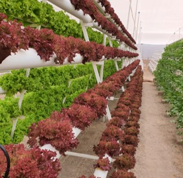

  
  

 Die Landwirtschaft der Atacama Wüste hat unter anderem mit Wassermangel und extremen Wetterbedingungen zu kämpfen. Was eine ernste Problematik für die Landwirte der Region darstellt. In diesem Projekt untertstützen wir den hydroponsichen Salatanbau einer Landwirtin aus <a href="https://en.wikipedia.org/wiki/Caleta_V%C3%ADtor">Caleta Vitor</a>

Für dieses Projekt platzieren wir verschidene Sensoren zur Datenerfassung der Temperatur, Solarstrahlung, PH-Werten, Wasserströmen u. a. Die erfasste Daten werden über ein lokales Netzwerk (LoRaWAN) gespeichert und bearbeitet. Anschließen kriegt der Endkunde eine graphische Darstellung der Ist-Wert seiner Anlage. Mit dieser Lösung kann der Landwirt mit der ermittelten Information Entscheidungen treffen, die zum Schutz der Ernte dient.

Zur weiteren Informationen der technischen Entwicklung dieses Projektes kontaktieren Sie mich bitte via <a href="mailto:franco.perez.montt@gmail.com">Email</a>  
 
 

