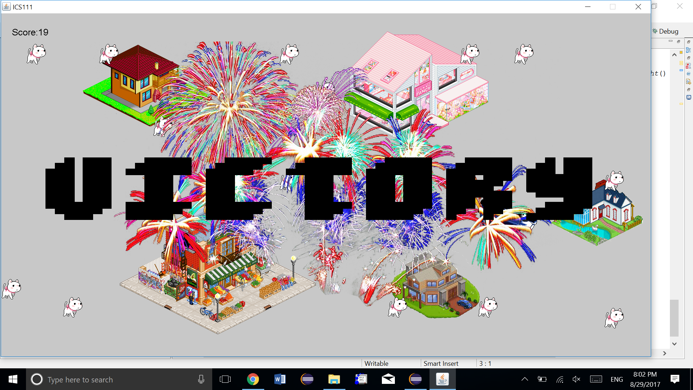

  
  

This was one of my first projects that introduced me to ICS and resulted in my decision to enter the Computer Science field. The obstacle course game is very simple. In the project, the goal of the game is to use the WASD keys to move around and collect objects that are moving around randomly, while avoiding stationary objects. When all the objects are collected the game stops and a victory sign is shown and victory music plays. If the player crashes into a stationary object, the game is stopped and a failure sign is shown. The game resets when the player fails. 

As an introductory course, it might be difficult for students to create complex video games from scratch, so a Java Graphics Library called EZ created by Kobayashi Dylan was implemented. This made it easier for students to visualize and learn Java as they code programs. This project gathered all the information I knew at the time about Java and combined it into a little game. I learned not only object oriented programming, but basic skills, like organization of code

A link to the run through of the game [(link)](https://www.youtube.com/watch?v=17zKbO1nIhM).

