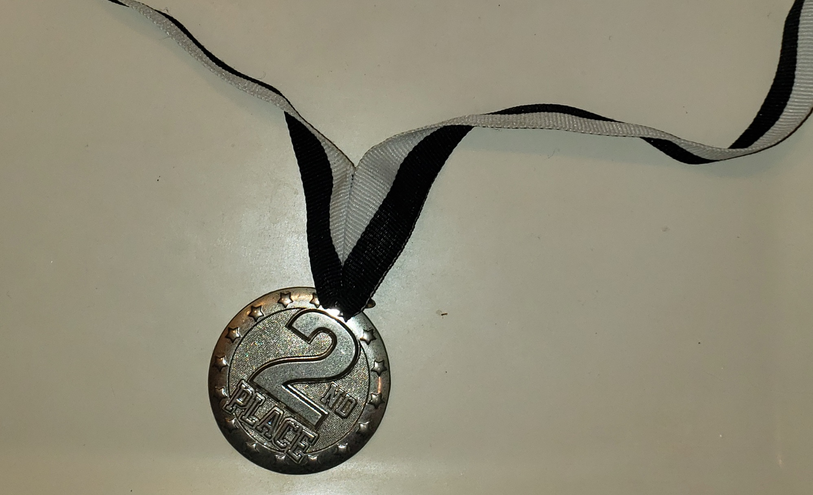

The 2019 HPU Scholarship Tournament was an open registration tournament planned by the Hawaii Pacific University but was still available for teams not affiliated with HPU. The teams were made up of at least 5 people. These teams would compete against each other in a randomized bracket format in video games. The games these teams would be playing were either "League of Legends" or "Overwatch" depending on which game they registered to play for. My team and I had registered for the "League of Legends" tournament. People playing one game would not play against people who were playing the other game. League of Legends is a multiplayer online battle arena (MOBA), much like a team-based strategy game where two teams of five powerful champions face off to destroy the other's base. 

League of Legends requires lots of communication, patience and teamwork by its nature of being a competitive game. However, because there are also so many things that each player has to micromanage, someone has to also macromanage the game and the team. My role in my team was to be the shotcaller, the one in charge of macromanagement. My team had made it to the finals of the tournament after several days of playing back to back games in the HPU eSports Arena. After a grueling 4 hours, we unfortunately were unable to win our 5-game series and the tournament but we had managed to get 2nd place.

Here is my medal that I earned from the tournament
<div class="ui small rounded images">
  
</div>

```js
byte ADCRead(byte ch)
{
    word value;
    ADC1SC1 = ch;
    while (ADC1SC1_COCO != 1)
    {   // wait until ADC conversion is completed   
    }
    return ADC1RL;  // lower 8-bit value out of 10-bit data from the ADC
}
```

You can learn more at the [UH Micromouse Website](http://www-ee.eng.hawaii.edu/~mmouse/about.html).


