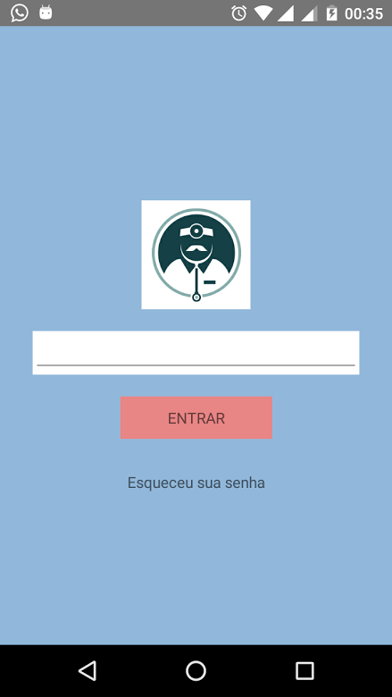

---
layout: project
type: project
image: images/projeto1.jpg
title: Doctor
permalink: projects/Doctor
date: 2017
labels:
  - ReactNative
  - NodeJS
  - Firebase
summary: Desenvolvimento de uma aplicativo para gerir atendimento de uma clinica. O médico poderá preverser a quantidade de pacientes irá atender no determinado dia e hora em uma clinica. 
---

  
  
  
  

Percebemos a necessidade de gerir o tempo no atendimento a pacientes em uma clinica hospitalar. Uma das maiores preocupações foi informar ao médico quantos pacientes evitando atrasos e sobrecarregar o profissional com mais atendimentos.

O Aplicativo tem funcionalidades muito intuitivas: apos acessar o sistema o usuario poderá ver uma lista de pacientes/users informando o dia, hora e nome da clinica na qual irá ser atendido.

Mais sobre o app [Repositorio](https://github.com/alexjosesilva/AppFarmacia).

