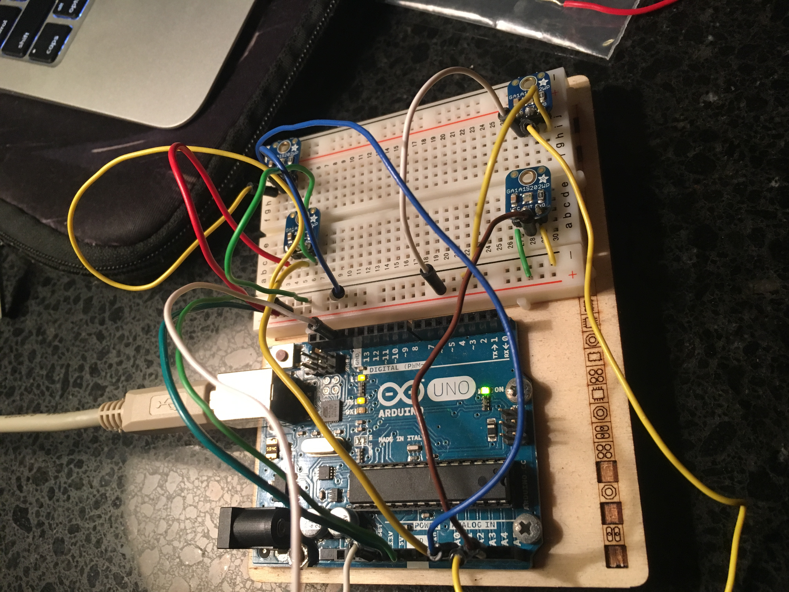

  
  
 

This project involves the usage of the micro-controller of Arduino to carry out the mechanical and electrical execution of a solar panel mount with a dual-axis tracking method. The challenge to the system remains to maximize the efficiency by capturing the rays from the sun for conversion into electricity. Under normal operating conditions the system is fully automatic and requires minimal operator input. In terms with these parameters we set, it will increase efficiency and energy storage.

Role and Contribution-Motion control: 
I built the infrastructure of device and attempted to do my version of the light sensors but Clark’s code was better and executable in the end. I had different versions of base and the tilting of the solar panel. My part had to be done first so that Clark and Ross could implement and test their part. At first I put together a wooden frame and brackets and later changed it to metal rod. I research a couple different designs but the most stabilized one was the one I decided on. At first I was using Clark’s skate bearing for the base because it had very little friction but changed it because of instability of the actuator. The motion is control by a servo with a belt to catch onto the gears for precise movement. The infrastructure is mounted on top of 2x4 wood panels and a medium density board to place all the battery and circuit components. If we had a bigger budget, we would have used a lighter material that would be ideally portable. 

You can learn more about the project [here](http://www.solarpaneltilt.com/).

