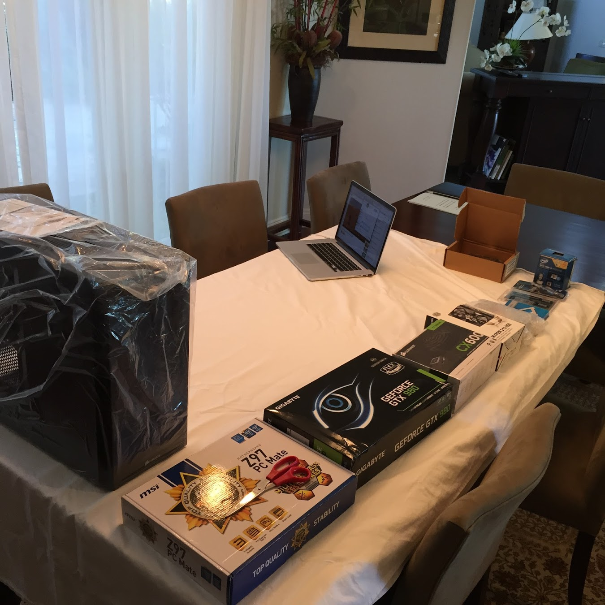
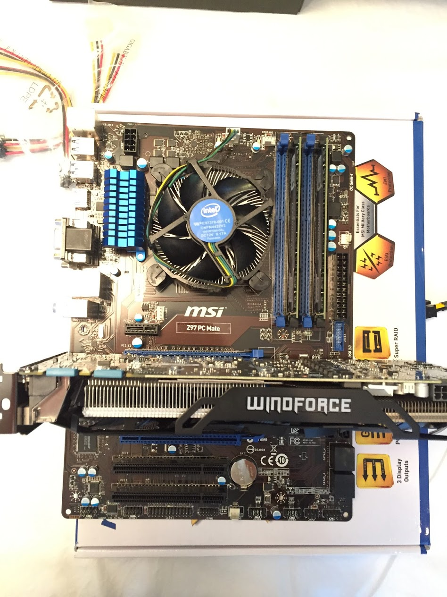

  

I have always been a fan of video games. In middle school I had this old macbook I would do most of my computer gaming on. However, in early 2014, my computer started to become less responsive, and eventually broke altogether. The cost to fix the computer would have been more than buying a brand new one, so I decided to buy a new computer. A few friends that I played games with told me building my own machine was the most cost efficient way of buying a new computer. At first the thought of building my own computer seemed too difficult for me, however I looked into it anyway. That is when I started to learn about of all of the different major components that go into creating a computer. It was fascinating learning about each components role and how they all worked together. Reading about GPU, RAM, SSD, etc, was really interesting because these were all terms I had heard before, but never really understood. After many hours of research, benchmarking, and compatibility checking, I had finally created my ideal list of hardware. Since it was already late October, I waited patiently for the black friday / cyber monday deals. Finally, all of the components arrived and I was ready to build my first computer.

  

Building the machine itself was rather straightforward, and I didn’t run into any major difficulties like I thought I would. Installing the Windows 8.1 OS and all of the necessary drivers to get my computer functioning properly was a little more challenging, but nothing I couldn’t handle. I got my computer up and running, jumped into discord, and celebrated with a night of gaming with friends. Having never done something like this before, building this computer taught me that even if a task seems difficult at first, putting in the time to break down the problem and understand each component makes solving the problem a lot easier.
