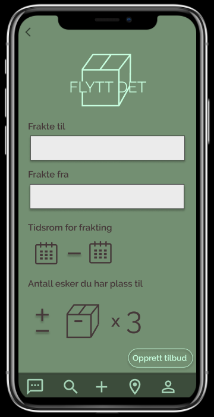
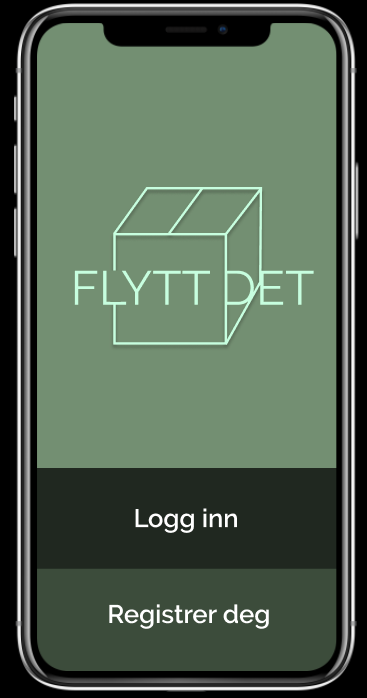
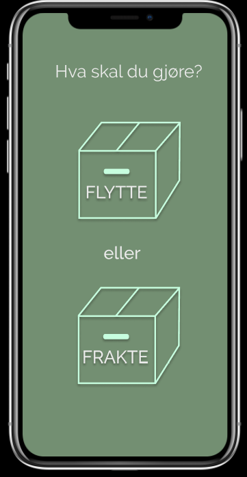

I joined a hackathon in Bergen in March 2019. The represented task were as follows: make up a new product or service for the furture of sustainable mobility.

We got paired up in teams, and got 24 hours to finish up our prototype. The day after we were pitching the idea infront of a jury. The jury based their judgement on three factors; personal mobility, use of data for new and existing mobility services and future Urban Logistics. 

  
  
  
   

During this project we used Google design sprint as method and Figma as prototyping platform. Our result was based on the factum that all the team members are students, and have moved several times the last couple of years. 

Our project was calles Flytt det (move it). The concept of Flytt det is that student easily can get their things transported from a place to another without driving their own car both ways. Today it is not a well functional eco-friendly solution in Norway to send your things from A to B. Flytt det is an app where you can send your things with anyone how is going to the place you want to bring your things. The user does not have to pay anything, but all the users have a rate at their profil. The rate will ensure that the users behave appropriate and take care of the luagge they are transporting. 

<a href="https://www.youtube.com/watch?v=Q2et7aafWsU">Here </a> you can see a video from the Hackathon

