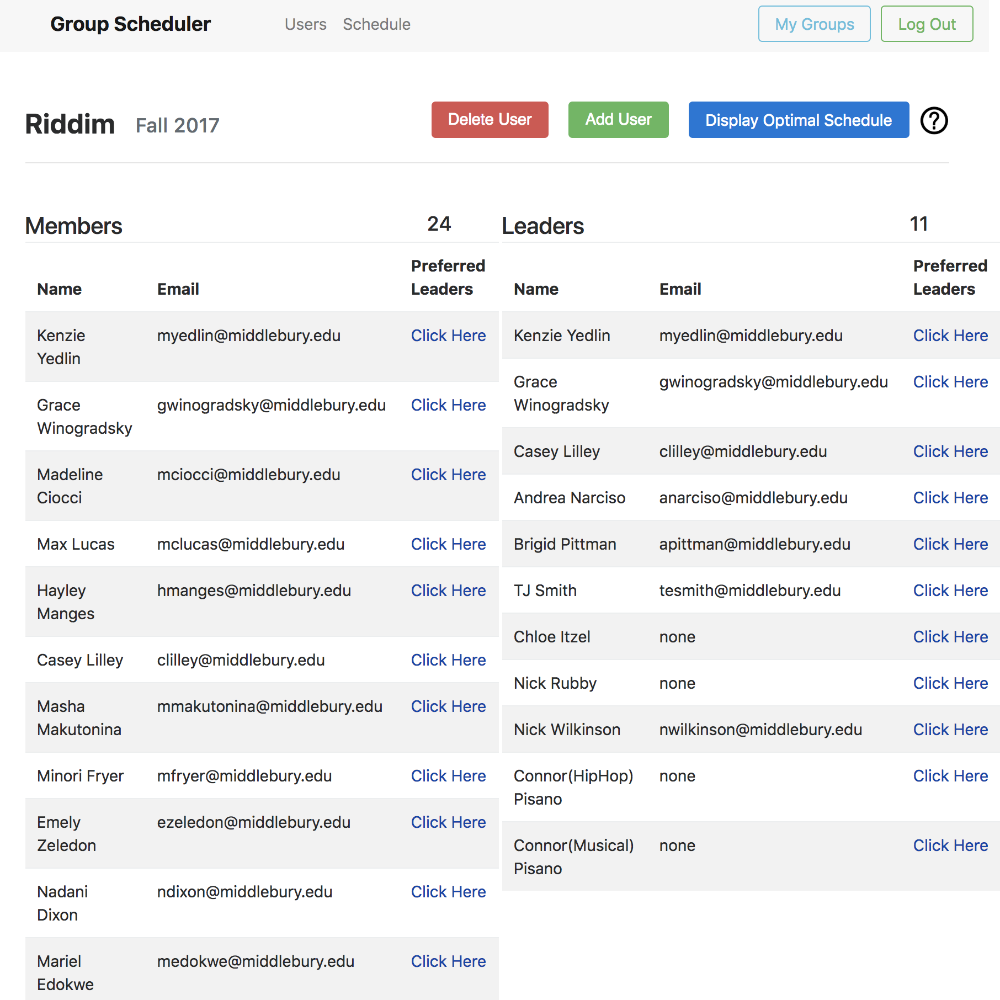
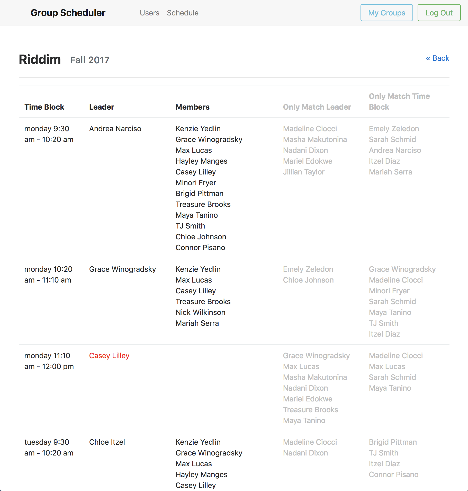
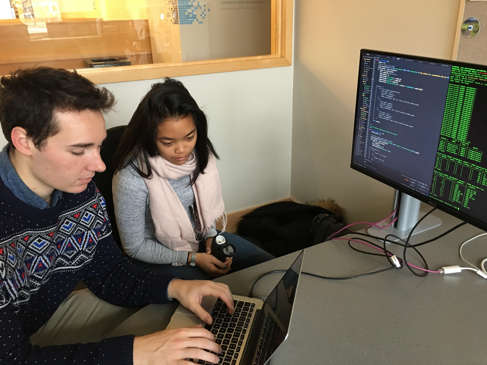

  
  

Every semester, the Riddim World Dance Troupe face a scheduling dilemma. The co-directors receive the availability of the choreographers and try to schedule rehearsals around those constraints, which is often a tedious and time consuming process. Additionally, this scheduling process does not take the dancers preference for specific choreographers nor their availability into account leaving the majority of Riddim members frustrated with the outputted schedule. 

Thus, the goal of this project was to implement an algorithm that takes not 1, but 3 factors into account— choreographers' availability, dancers’ availability and dancers’ preferences for specific choreographers— and outputs an optimal schedule for all parties involved. This algorithm was embedded in a web application where the Riddim co-directors and administrators can input everyone’s availability and preferences, run the algorithm and view the outputted schedule. The third goal was to collect real world data from Riddim and have them test the web application. 

  

Chris Fetterolf and I collaborated as the the lead Software Developers of the project. We worked as a team alongside our Project Manager, Joe Antonioli and Project Supervisor, Daniel Scharstein. As a software developer, I was responsible for the log in and schedule output pages of the web application. I also researched existing algorithms then wrote the code surrounding the Hungarian algorithm to modify and apply it to Riddim’s scheduling problem. In this project, I also acted as the Product Developer and served as the connection between the Software Development team and our customers. I conveyed the needs of the customers to the team, collected real world data from our customers to test our product and get feedback.

This project was an incredible learning experience. I got to work on a software development project from start to finish, from analyzing a problem that my dance group faced to testing the program with real world data. I gained experience in using the ‘Minimum Viable Project’ throughout each iteration of the Design Thinking cycle and got to work with each technology from the back to the front end. Additionally, in working in a team with another software developer and project manager, I learned how to use SWOT to work off of the individual strengths and weaknesses of each member. 

At the end of the project, we made a <a href="../images/riddim-poster.pdf">poster</a> that was posted in the Computer Science Department at Middlebury College. We also gave a presentation to the project's stakeholders to explain the problem, our solution and the status of the project. Through this process, we learned how to effectively present our work to people with varying backgrounds in tech.
poster

Github link to the <a href="https://github.com/cfetterolf/CS500/blob/master/python-getting-started/schedule/algorithm.py"><i class="large github icon"></i>algorithm implementation</a>

