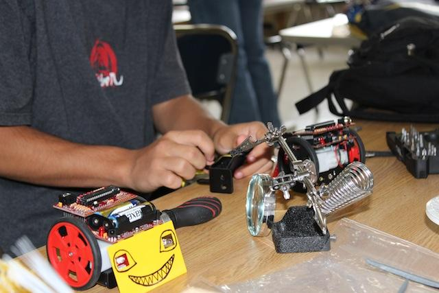
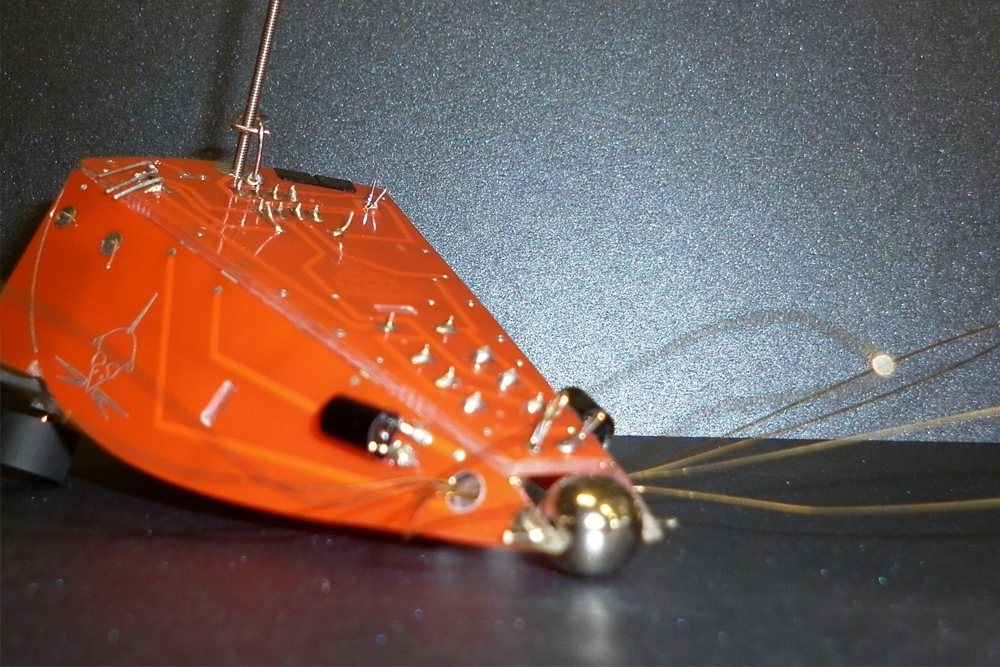
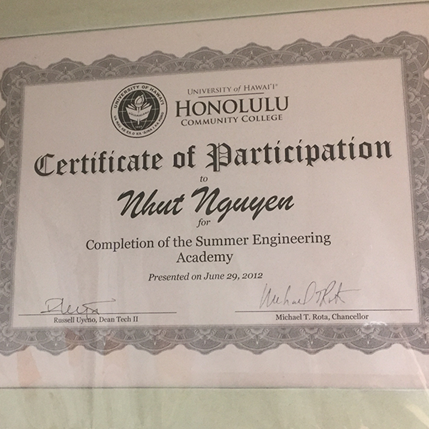

  
  
  
  
  

In the summer of 2012, I had a chance to experience and competed in three engineering competitions: Sumobot, Mousebot Race, and Spaghetti bridge building. I was lucky enough to win two out of three competitions (Sumobot and Mousebot Race)against 30 other students, but even if I didn't win anything, I would also be satisfied with what I learned about Engineering. I was stunned about the technologies that I was able to use to build the robots.

First of all, I want to talk about the Mousebot. For this robot, we learned to assembly the Mousebot from scratches. The Mousebot was controlled by a chip board. One interesting thing about the Mousebot was that it had a sensor that could detect the light and always move towards the light. The sensors were placed on two of its eyes, (Yes, the eyes were not for decorating only) so it could detect the light from both sides. The biggest challenge to assembly the Mousebot was to make sure the eyes are aligned correctly because if they are not balanced, the Mousebot would be confused about the source of the light and it would keep spinning around and around. That happened to a lot of students including me, but luckily I was able to fix it to make it work.

Second of all, and also my favorite, the Sumobot. Maybe you could have guess what it does from the name, they knocked each other out, well technically. However, one more thing about the Sumobot was that it also had a sensor to detect the arena and make sure it wouldn't drop out of the arena intentionally even after it pushed its oponent out of the ring.

In summary, I had learned many different things in that Summer Program, and the experience that I had, I would never forget. It helped inspire me more about technology, it gave me a vision about how the future may look like, and I also want to be apart of that.
You can learn more at the [UH Manoa P-20 Website](https://manoa.hawaii.edu/news/article.php?aId=5178).

