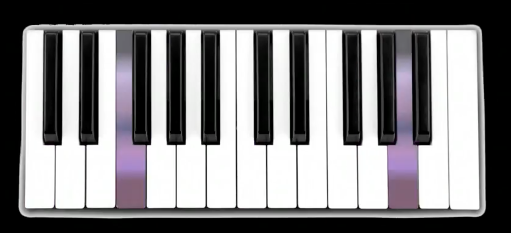

  

This was an assignment for my ICS 111 (Intro to Computer Science) Class.  The project was to make a playable musical instrument with sounds of our choosing.  I chose to make a classic piano, and included both piano and vibraphone sounds.  

The user interacts with the instrument by pressing keys on the computer keyboard.  The default sound is the piano, and can be switched to the vibraphone sounds by pressing the Caps Lock key on their keyboard. 

The project is written in Java with much help from the EZ graphics library created by Dylan Kobayashi.

To see a quick demo click [here](https://www.youtube.com/watch?v=fChNjBPrxiw)

