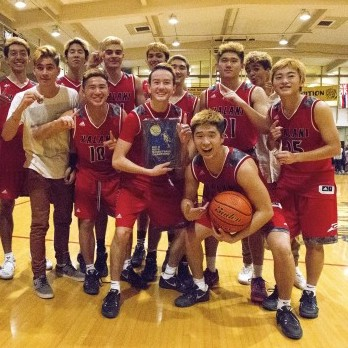

  
  
  
  

In high school, I played varsity basketball for my high school, the Kalani Falcons. I became a team captain for the team, which came with a lot of responsibilities such as communicating information given to me to the whole team. At the start of the season, I was more of a lead by example leader, and thought that by just doing extra work such as strength training and spending extra time after practice to work on my game was enough to motivate my teammates. However, as the season went on, I had to learn how to become a more vocal leader and encourage people when they were down, and bring people down when their confidence started to turn into arrogance. All the trials and tribulations of injuries, teammates not getting along at times, and some heartbreaking losses, led to our success as we won the OIA Division II Championship. 

