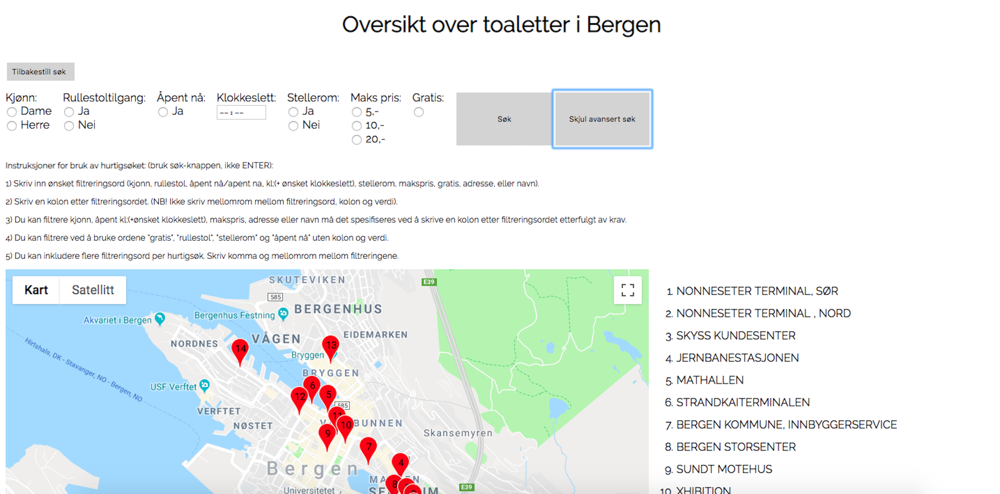

 

 

Livet i vest (life on the west coast) is a webpage based on an exam from school. The project was produced in teams of four, where we were given different requirements who had to be fullfilled. The concept behind the webpage is to locate different toilets, playground and nightclubs at the west coast in Norway. They are both located in the cities Bergen and Stavanger, but they are seperated in different subpages. The webpage is built by using javascrips, html and css. 

Some of the subpages allows you to do different searches. On the subpage "Toaletter i Bergen", you can either do a regualr search or or the advanced search. By using the regular search it is possible to write in keywords like "sex: male" or "opening hours: 18:00" and based on the search, the toilets who meets the requirements will show up. The advanced search is based on predetermined parameters, and you can therefore tick off what you prefer to see. 

Here you can see pictures of the the advanced search and the code of one of the criterias for the advanced search. 

function avansertsok() {
    var resultatet = [];

    //Sjekker om brukeren har huket av for mann eller dame og gir sokekravobjektet en attributt med resultatet
    let kvinne = document.getElementById("dame");
    let mann = document.getElementById("herre");

    if (kvinne.checked) {
        sokeKriterier.kvinne = "1"
    } else if (mann.checked) {
        sokeKriterier.mann = "1"
    }
    ...
    }

 
<a href="http://wildboy.uib.no/~gen009/index.html">Here </a> is the link to the webpage.
 
