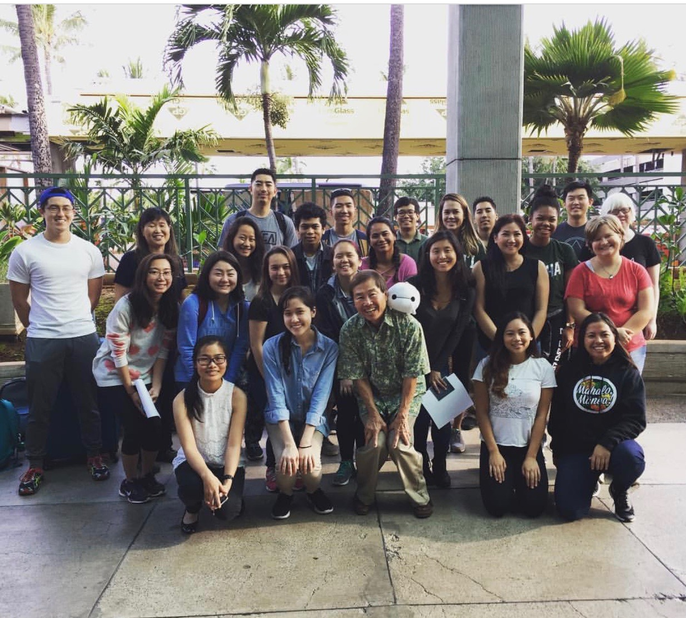
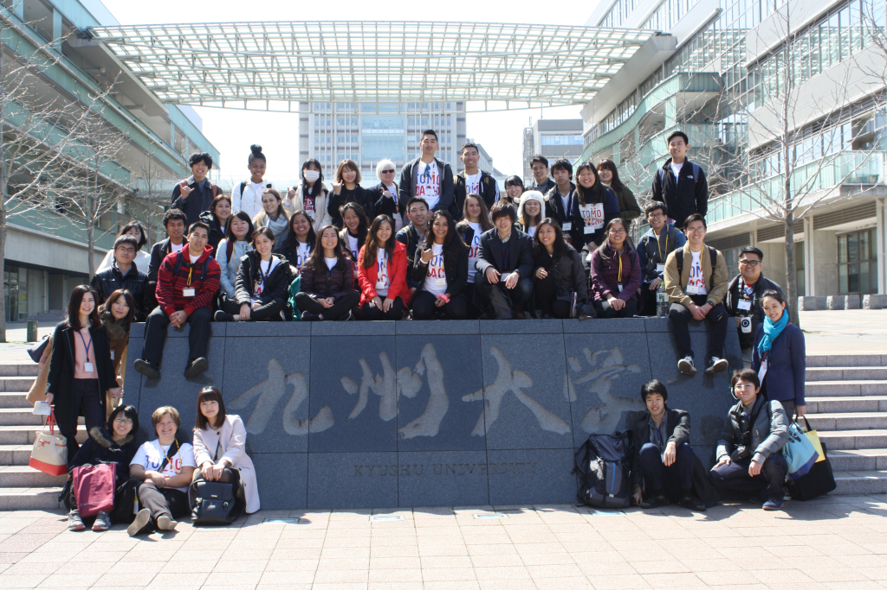
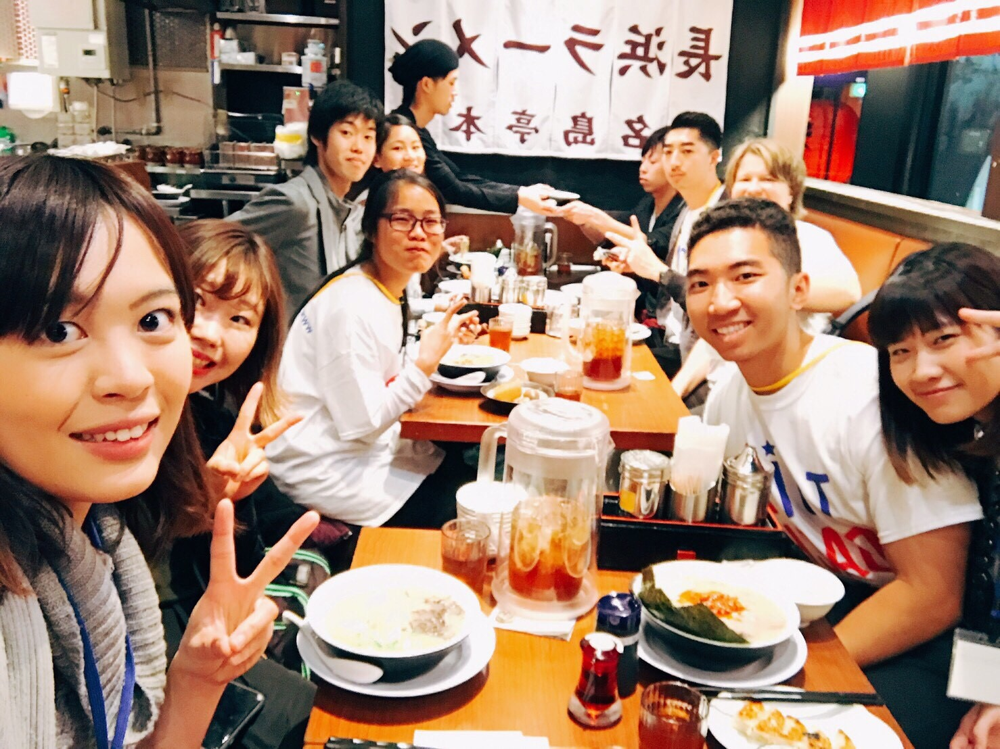

In the spring of 2017, I, along with 22 other students, was able to go on an all expenses paid trip to Japan as scholars of the Kakehashi Tomodachi Scholars Program. The program was developed by the US-Japan Council; it was created to allow more interactions between Japan and the US. 

Kakehashi means bridge in Japanese, and Tomodachi means friend. The goal of the program was to introduce US students and Japanese students, to create friendships and develop a connection that links US and Japan.

This year, our group participated in a student exchange with students from Kyushu University. They learned about the legacy of Daniel Inouye and had a tour of UH Manoa's campus. During spring break, our group of students went to Japan, where we learned about Japanese history, technology, and culture. We also spent quality time with the Kyushu University students.

Vacay is implemented using [Meteor](http://meteor.com), a JavaScript application platform. Within two weeks, we created a website that implements several types of reservations including flights, hotels, and car rentals.

In this project I gained experience with full-stack web application design and associated technologies, including [MongoDB](http://mongodb.com) for database storage, the [Twitter Bootstrap](http://getbootstrap.com/) CSS Framework for the user interface, and Javascript for both client and server-side programming. 
 
Source: <a href="https://github.com/theVacay/vacay"><i class="large github icon"></i>theVacay/vacay</a>
