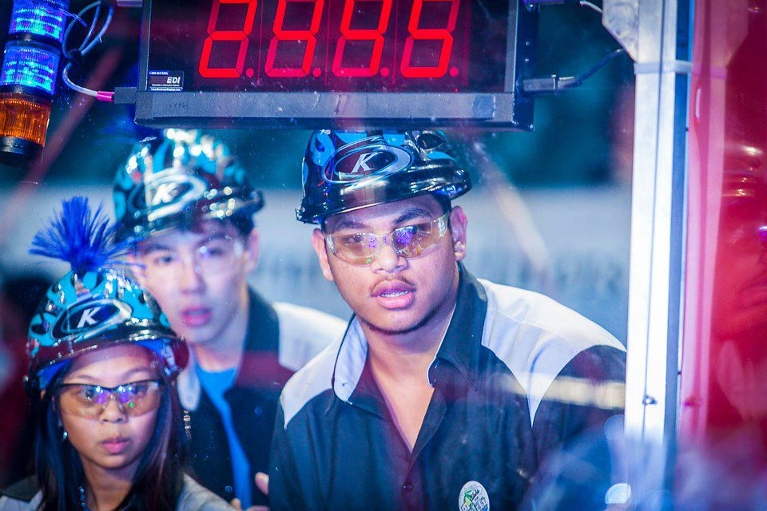
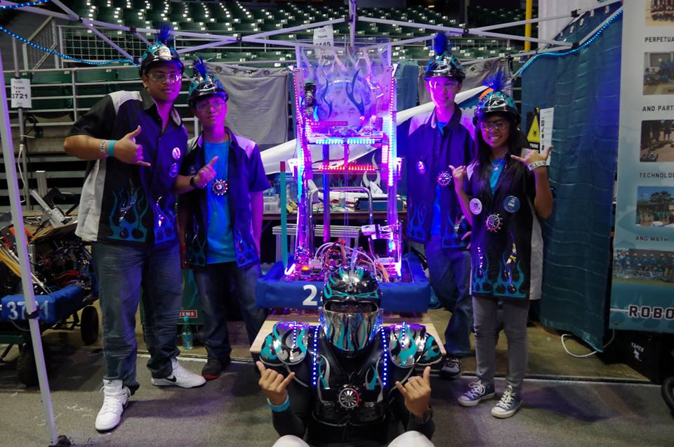

  
  
  

Ultimate Ascent was the 2013 FIRST robotics competition. We were given 2 months to build a robot to compete in this competition. The goal of the competition is to gain as much points as possible. You gain points by shooting discs into the goals on the oppisite end of the field or on top of the pyramid. The teams can score additional points in the beginning autonoums period, or at the end when the robot has to hang on the pyramid. The robot can only hold up to 4 discs and can pick up discs from the ground or be loaded manually. You can learn about the game in full detail by watching this [vidoe] (https://www.youtube.com/watch?v=wa5MGEZNrf0&list=PLZT9pIgNOV6Ya-bFLZiwVFX8biV6qgUQu&index=10).

The year 2013 was my senior year and I was a part of both the mechanical team and head of the design team. I was able to design and make parts for the shooter of our robot. Our robots design was to be a high shooter. We had an elevator that can be lowered to be loaded and can extend to the top of the pyramid or the highest goal. We also had a scooper mechanism that allowed us to pick up discs from the floor. I stayed back mostly every day of school until 6 at night and really enjoyed making this robot with my teammates.  Then during the competition I was chosen to be the main driver! We went all the way into the semifinals.
 
