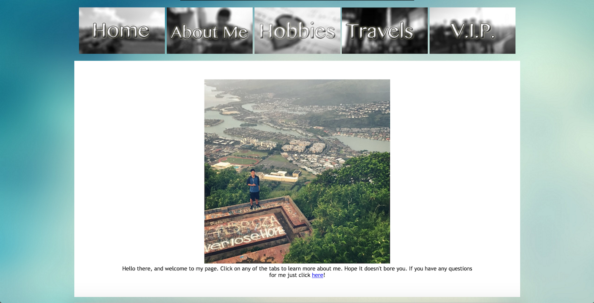

This site was the final assignment for ICS 101 (Tools for the Info World) class.  The class is an introductory class that teaches how to use modern day software, as well as a broad overview of the entire Computer Science field.  The software that is taught in that class includes Microsoft Office, Adobe Photoshop and Dreamweaver, and Secure Shell.  The class also opens the opportunity to becoming an undergraduate teaching assistant for the course.

This assignment was to ensure we understood basic concepts of how HTML and CSS works, and that we could create a website to be view online.  I created an "About Me" that has pages including my hobbies, travels, and a small bio of who I am.  The site is created with the help of Dreamweaver, a development tool for creating, publishing and managing websites.

To view the site, click [here](http://www2.hawaii.edu/~kylebali/me/)
