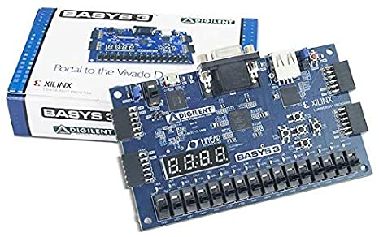
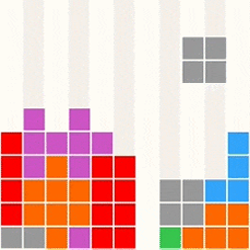

When I took EE 260, Introduction to Digital Design, the main point of the class was well as the name implies, how to design digital circuits. Some of the things that was learned in the class was creating clocks, how to implement logic, etc. At the end of the semester the class was told that if you could follow the lab instructions to implement a microprocessor in Verilog on Vivado, and implement it onto a Basys-3 board, you would get a whole lab worth of extra credit. Now me and my partner were interested in this, so we decided to put our all, to try and get this working.

There were various things we had to learn first before really getting into this project. The most important thing was well, learning exactly how a microprocessor worked, as we had no idea how it worked. Following the lab manual, as well as help from the TA, we were able to get some code up and working, as we incrementally worked our way through checkpoints in the lab handout. We learned we had to adapt to the situation as the hardware we were implementing the code to, the Basys-3, had different specs than what was used in the lab manual.

It took us many hours of debugging and staying after lab hours, but we were finally able to get the code compiled and running. Now the fun part of the project was that it included some files to flash a game to the memory of the Basys-3 board. A couple clicks, some waiting, and more debugging later, it finally showed up on the old VGA monitor, a Tetris game playing way too fast, but still amazing. By running these games on the processor, we gained some insights into how programs work in general. This project gave me many insights on how a microprocessor works with a PC counter, how it accesses memory, etc., and was really cool!
 
