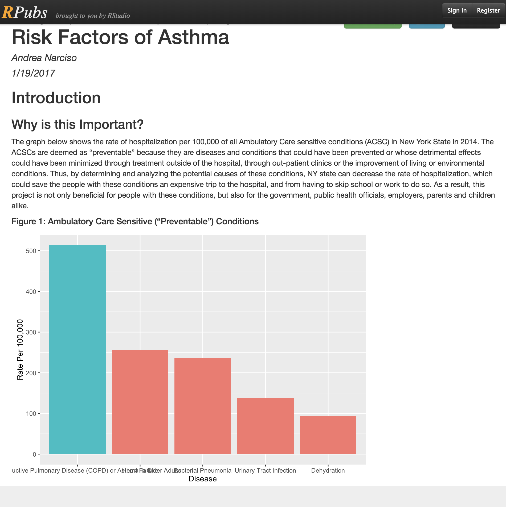

My Dad suffers with asthma that worsens significantly in areas with high air pollution. With my background in Data Science and interest in how these tools can apply to the medical field, I decided to investigate the risk factors that result in such a high rate of hospitalization for asthma using a correlational study. I specifically focused on air quality as it is an environmental factor known to worsen asthmatic symptoms. I also investigated income per capita and health insurance as they are two socioeconomic factors that prevent people from receiving proper health care. In this study, I looked at data from New York State in 2014 hoping that this case study would give me insight into my Dad’s condition and serve as a starting point to understand the risk factors of asthma throughout the United States.

I was the lead Data Scientist for this project and thereby was responsible for conducting the exploratory data analysis. I started by researching the rate of hospitalization for Asthma, it’s risk factors and then conducted a correlational analysis using R. The results showed a negative relationship between air quality and rate of asthma after removing the outlier, a negative relationship between income per capita and rate of asthma and a positive relationship between the proportion of the population without health insurance and rate of asthma. One of the most interesting and informative findings was making sense of Bronx as an outlier and you’ll have to read my article (link!) to find out more. As the lead Data Scientist, I conducted research to analyze the results and also produced a formal report and presentation for the study. 

Throughout this process, I developed my skillset for R and data analysis. This project was in incredible opportunity to work on real world data and explore how I can use data analysis to address a significant health problem in the United States.
 
Source: <a href="https://github.com/acnarciso/Final_Project"><i class="large github icon"></i>Final_Project</a>
