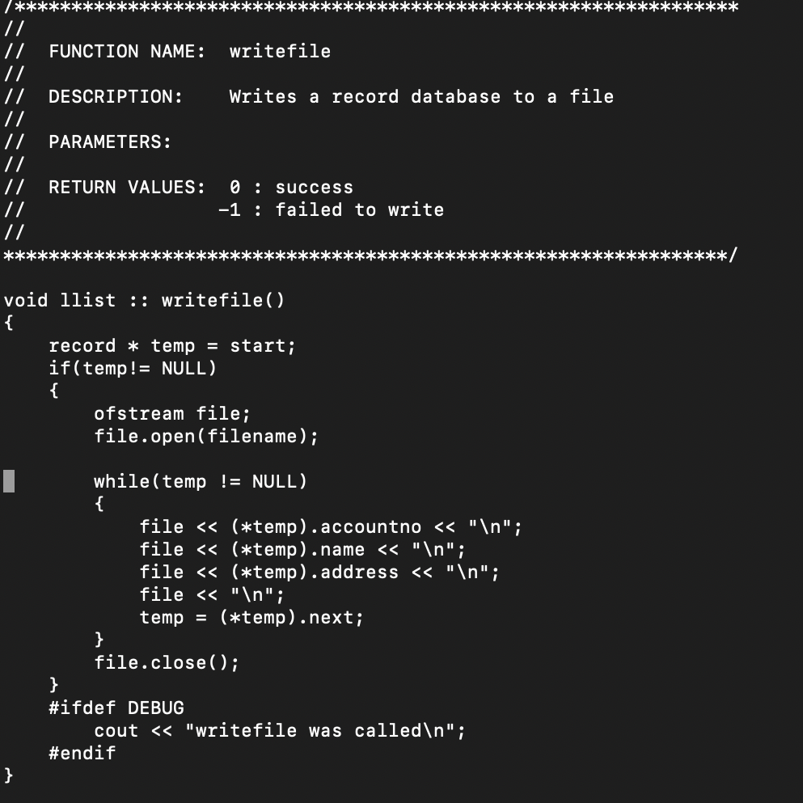
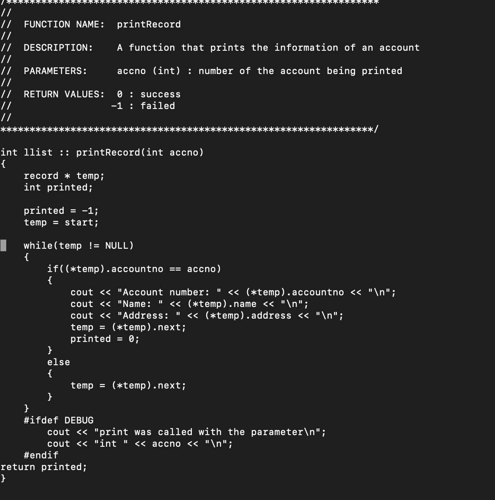

For ICS 212, I created a database in C++ that stores the name, account number, and adress of a person. Records are added by account number in ascending order. The program is able to print information for a given account number, and also has the ability to print the entire database. Accounts are also able to be deleted. Once the program is exited, the function writefile is called which writes to a text file the information that is in the database. When the program is started up again, the readfile is called which then reads the text file and adds the information to the database.

  

Example code of the addRecord function:

int llist :: addRecord(int accno, char name[], char address[])
{
    record * temp = new record;
    record * tempprev = new record;
    record * newrec = new record;
    int added;
    added = -1;

    (*newrec).accountno = accno;
    strcpy((*newrec).name, name);
    strcpy((*newrec).address, address);

    if(start == NULL)
    {
     	strcpy((*temp).address, address);
        strcpy((*temp).name, name);
        (*temp).accountno = accno;
        (*temp).next = NULL;
        start = temp;
        added = 0;
    }
    else
    {
     	temp = start;
        if((*newrec).accountno < (*temp).accountno)
        {
            (*newrec).next = temp;
            start = newrec;
            added = 0;
        }
        else if ((*newrec).accountno > (*temp).accountno)
        {
            while (temp != NULL && (*newrec).accountno > (*temp).accountno)
            {
                tempprev = temp;
                temp = (*temp).next;
            }
            (*newrec).next = (*tempprev).next;
            (*tempprev).next = newrec;
            added = 0;
     	}
        else
        {
            (*newrec).next = (*temp).next;
            (*temp).next = newrec;
            added = 0;
        }
    }
    #ifdef DEBUG
     	cout << "addRecord was called with the parameters\n";
        cout << "int " << accno << "\n";
        cout << "char[] " << name << "\n";
        cout << "char[] " << address << "\n";
    #endif
return added;
}
