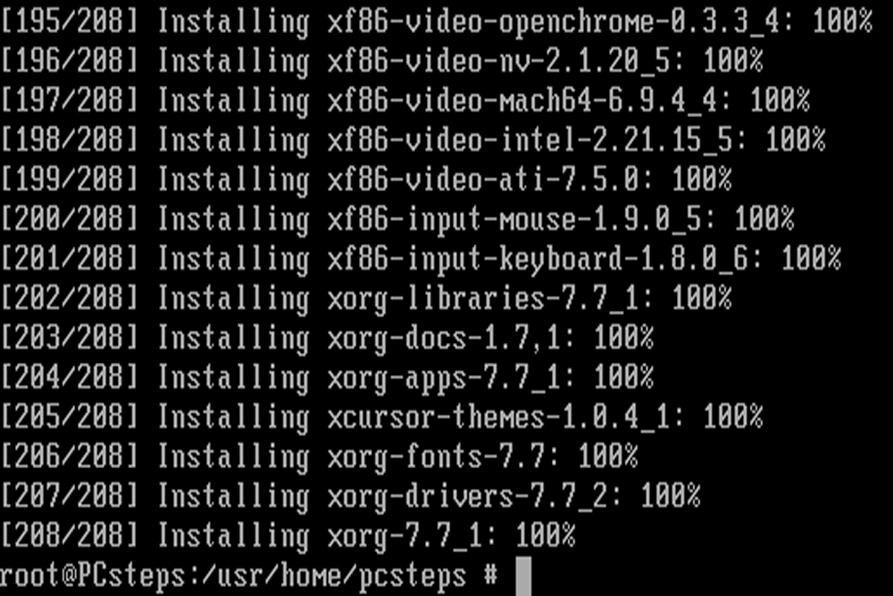

One day, when I came to work, and my boss told me about a professor who asked her to help him set up the SmartBoard that can run on Linux (it used to run on Windows). She said <i>"That's a great opportunity for you to learn to work on Linux, you should give it a try."</i> I guess she's right, and I jumped right in to work on this project.

I had worked on Linux before, but it was the first time that I had total control on a Linux machine that I started from scratch. Because the software for the SmartBoard only work on the 32-bit machine, so I had to reinstall the operating system as well.

Although, we planned to finish this project in two weeks (16 hours), it took us the whole month because Linux was not as easy as I thought it was. In order to install the SmartBoard software, I had to modify the keys, extract the packages, sign the packages with my own secret keys...and more things that I never know before.

In this project I gained experience with how to work with Linux, about how to install packages after packages until it meets the requirement for the package that I wanted to install. It wasn't a pleasant journey, but I'm glad I was able to learn enough to succeed.
