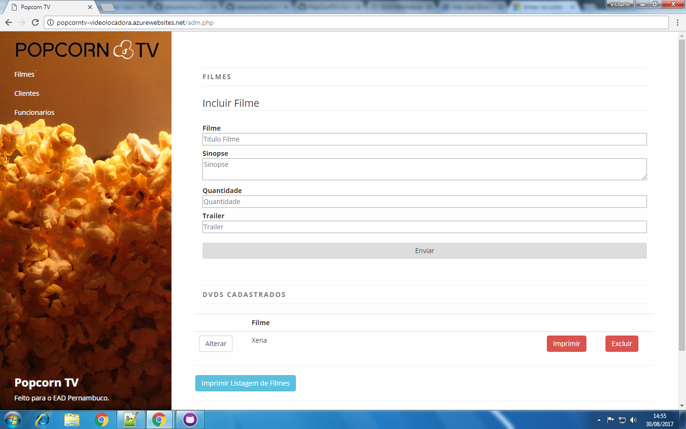

	

Custumização de uma solução para gerenciamento de videos em uma empresa de locadora de video: cadastro de produtos, listagem, edição ou exclusão 
 

Source: <a href="https://github.com/alexjosesilva/PopCornTV-VideoLocadora">
			<i class="large github icon"></i> PopcornTV
		 </a>
Url: <a href="http://lojavirtualcodeigniter1.azurewebsites.net/">
			<i class="large fa-google-play icon"></i> PopcornTV
	</a>
		 
		 

		 