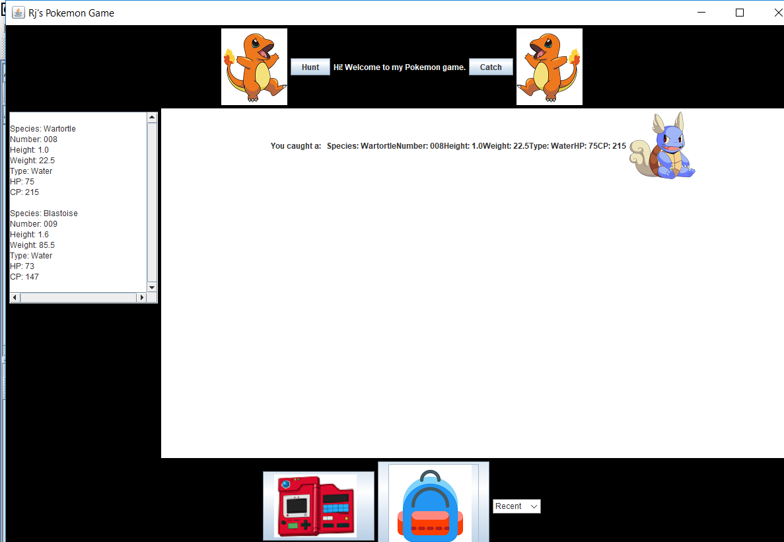

Welcome to the world of pokemon. Pokemon is a game that was first created in Japan, in 1996. The pokemon franchise blew up in popularity that allowed gamers all over the world to explore a role-playing game to capture creatures and battle with other players.

This project was a final project in an ICS 211 class using the programming language Java. The goal was to produce a fully functional pokemon game that invloved the use of GUI and MANY java files. This project taught students how objects were used in java using implementation and abstract classes using extend.

The most challenging part of this final project was creating GUIs. Although it wasn't part of the assignment to have everything looking clean just so long as it works. However, after finishing the project, i quickly became obsessed and addicted to creating the perfect GUI that fit the assignment and looked like something i am proud to call my first game.
 

