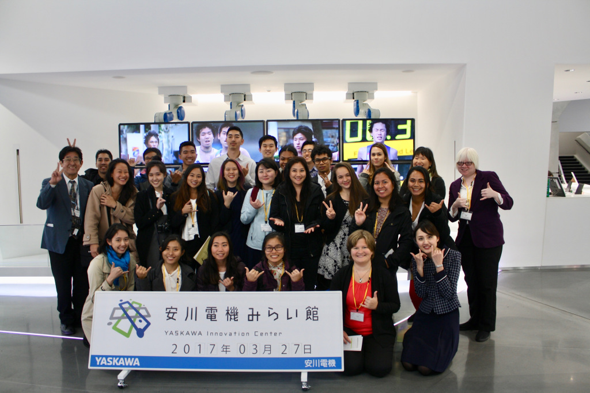
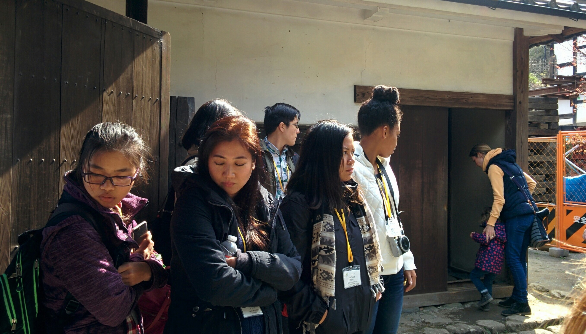

In the spring of 2017, I, along with 22 other students, was able to go on an all expenses paid trip to Japan as scholars of the Kakehashi Tomodachi Scholars Program. The program was developed by the US-Japan Council; it was created to allow more interactions between Japan and the US. 

 Kakehashi means bridge in Japanese, and Tomodachi means friend. The goal of the program was to introduce US students and Japanese students, to create friendships and develop a connection that links US and Japan.

This year, our group participated in a student exchange with students from Kyushu University. They learned about the legacy of Daniel Inouye and had a tour of UH Manoa's campus. During spring break, our group of students went to Japan, where we learned about Japanese history, technology, and culture. We also spent quality time with the Kyushu University students.

I was extremely grateful to have been allowed to participate in the program. I was able to meet many different types of people and develop teamwork skills as we worked together on group projects. Through this program, I gained first-hand experience of a different culture and setting that I had to adapt to. I learned a bit about Japanese language and how to communicate despite a language barrier. Not only have I learned about the historical events in Japan, but present and future accomplishments.

As the schedule everyday was packed with events to do from morning till night, I also learned manage the small amount of free time we were given.  By saving energy during my breaks, I was even more focused and attentive on the tasks at hand.

Information regarding the Kakehashi Tomodachi Project can be found [here](http://usjapantomodachi.org/programs-activities/tomodachi-inouye-scholars-program/).
A blog regarding my experience can be found [here](https://uhtomodachi.wordpress.com/2017/04/01/my-experience-in-japan/).
