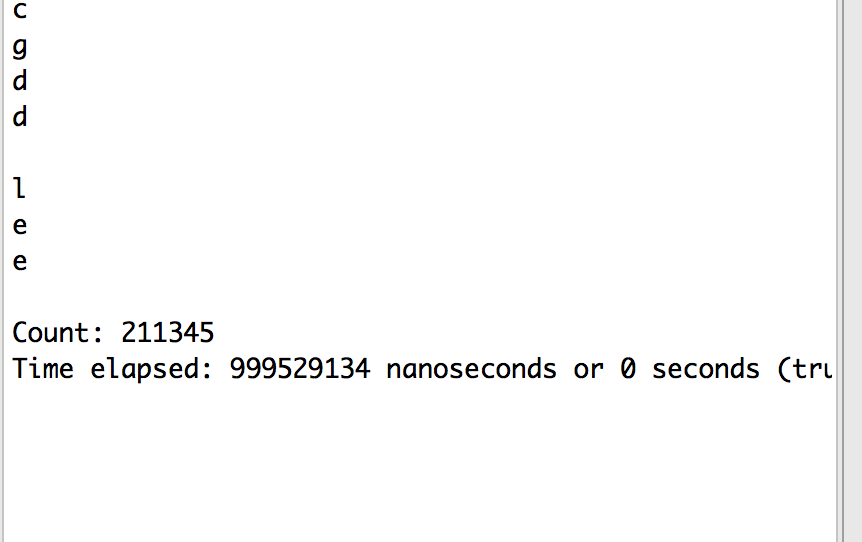
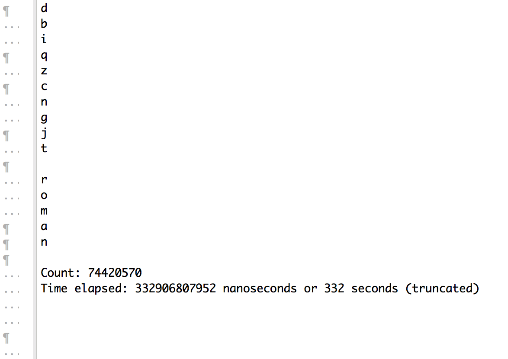
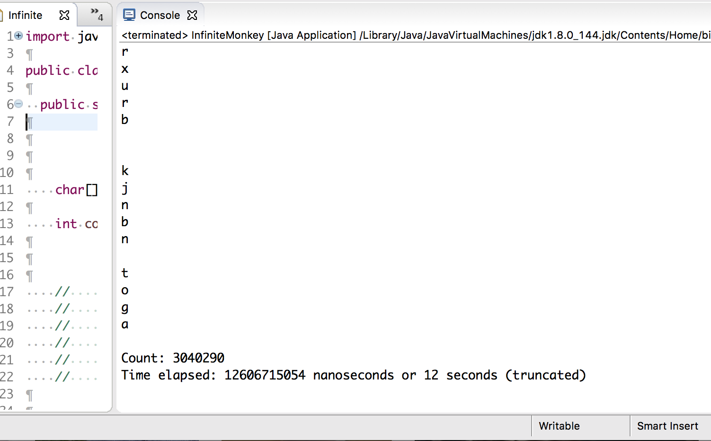
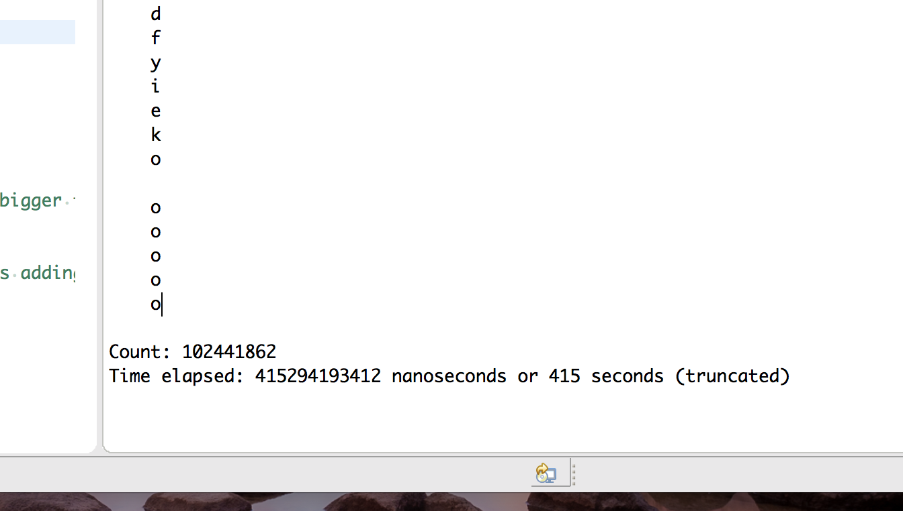

This small side project stemmed from pure curiousity. During my time being involved in ICS 141 (Discrete Mathematics for Computer Science), I gained familiarity with the concept of sets. Sets are a big part of discrete math, and there are many different insights one can gain from observing and working with their properites. 

In 141, we learned about probability, for example the probability of a certain event occuring with particular conditions. Related to this, we learned about strings, and how many different strings can be formed using a certain set of characters (for example the set containing the alphabet, or set containing numbers). 

Before taking ICS 141, I had come across this idea known as the "[Infinite Monkey Theorem](https://en.wikipedia.org/wiki/Infinite_monkey_theorem)". It is the idea that if a monkey sat at a keyboard and typed random keys (since a monkey cannot read letters), eventually the monkey will have typed some kind of readable English, perhaps a basic sentence. Given enough time (up to infinity), the monkey will have typed everything that has ever been known, even complex works such as Shakespeare. 

However, the math behind this actually shows that typing certain works, like a chapter book, is extremely unlikely, to the point where it would take thousands upon thousands of times the universe's existance to actually accomplish. For example, say we used the set of alphabetical letters as well as the space character (26 + 1 = 27). The chance to type "dog" would be 1 out of (27 * 27 * 27). Or, simplified, a 1 in 19683 chance of occuring. The more characters you require, the more that this number shrinks absurdly low. 

During my time in ICS 141 and ICS 211, I decided to merge what I had learned in both classes. In this case, to try and code something similar to the IMT in Java, to see if I could print anything legible using random characters. To my satisfaction, I managed to create a simple program that simulated this concept. The three elements behind this project were the set of alphabetical characters (including space), an int to count how many characters I've ran through, and a timer.

Here is the [raw-code]({{ site.baseurl }}/projects/IMTcode.txt).

I will also include screenshots of things I have printed using this program to highlight some of the probabilities:

  
  " lee"
  
  
  " roman"
  
  
  " toga"
  
  
  " a few"
  
  
  " ooooo"
  
  

 < < < *finding " god"*

It is interesting to see the time it took for the computer to print these words. Keep in mind that a computer also "types" at a speed many many times faster than a monkey. These were some of the longest words I could generate. When I attempted to try a sentence, my computer ran for about an hour or so before I called it quits. 

Overall, this was an interesting little side project. It shows how mathematics can be applied to a particular situation, and how mathematics can be demonstrated through code.

Note: The title image is from the short story *[The Library of Babel](https://maskofreason.files.wordpress.com/2011/02/the-library-of-babel-by-jorge-luis-borges.pdf)* by Jorge Luis Borges. I chose it because it is similar in concept to the Infinite Monkey Theorem. Basically the library is an infinite library filled with an infinite amount of books. The books contain all combinations of letters, meaning that everything that is known and can be known can be found in the library (It also means there is a whole lot of gibberish). I did read the story and found it interesting. I would recommend it to anyone interested in mind-twisting stories such as these.

  
 

***************************************************************************************

