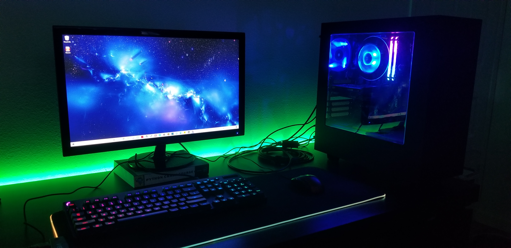

  

Late last semester I decided to build a PC. I had actually wanted to build one for a while but when looking for the parts, most of them were sold out. Having to replace and reconfigure parts ended up causing too much of a headache so I postponed till around Christmas 2020. I used the same case, monitor, and keyboard as my last build, but everything is upgraded. I wanted to be able to game on it, but nothing too crazy. 

I enjoy learning about computers and I would watch a lot of videos on people making them and pushing them to its limits. I researched a lot and used a website called pcpartpicker.com to help with software and hardware compatibility. After I had gotten the parts, my parents told me they'd be able to pay for it to help me with college. It ended up being about $1100. I don't need a computer nearly this powerful to do schoolwork, but it was definitely a nice upgrade from my laptop (I still use this laptop daily, a $300 Motile from Walmart. Cheap but reliable). 

I also put some RGB lights to make it look better. The mousepad is from a friend from Christmas, and the ones behind my desk are from my birthday that my girlfriend help put up. They definitely look better in person. Hopefully I can keep building computers because it's fun, but it costs a lot of money so I'm not sure how sustainable this hobby is.
