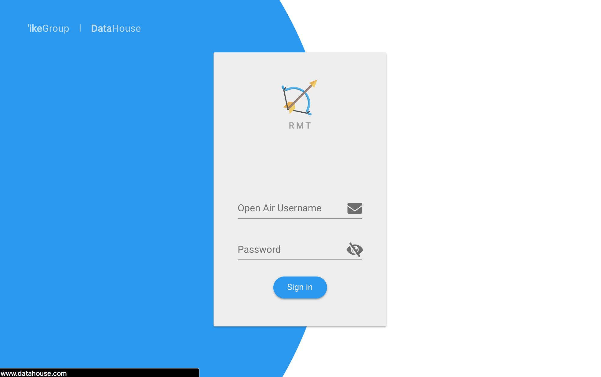

During the Summer of 2018, I had the privilege of being a part of an internship program at DataHouse Inc. While I was with DataHouse, I was assigned to a project team who were working on a web application call RMT (Resource Management Tool). “Resource” in this case refers to the developers/employees. RMT was designed with the project managers and executives of the companies in mind. One of the main features of RMT was resource allocation. DataHouse works on many different projects concurrently, allocating a percentage of a developers work hours to multiple projects. Keeping track of employees current allocation and being able to create and allocated developers to new projects was one of the services that RMT provided. I worked on some of the resource allocation feature, mostly writing express routes to query the OpenAir API, as well as our own MySQL database. The main features my partner and I were in charge of were the my/user profiles page, and bench strength. The idea was had for bench strength was to generate a list of “best fit” developers, based on project criteria. So when a project manager is allocating developers to a new project, a sorted list of recommended developers would be displayed with a score next to their name. My partner and I decided to divide the workload so that he would do the front end and I would be in charge of the back end. The technologies I worked with were Node JS together with Express, as well as MySQL. I also work with tools such as Trello, Postman, and MySQL Workbench. In order to start building our new feature, we first had to create a my/user profile page where users could enter technical skills and experience. For that, we needed two new data tables, one to told hold skill names, and one to keep track each person’s skills. I created the necessary model and migrations files, relating skill_id between each table. I also created a seeder file to prepopulate the skills table to contain technologies and skills I pulled from company resumes and other online resources. I then wrote express routes that my partner could use to request data from our database. After that was complete, all we had to do create an algorithm that compared developer skills and experiences with project criteria and implement it into RMT. Unfortunately, before I could see the final product, my internship had ended. Working at DataHouse was an awesome experience, and I am very thankful for the opportunity to have been an intern there. Not only did I learn new technologies , I learned about the workflow behind web app development.
 
Source: <a href="https://rmt.datahouse.com">
