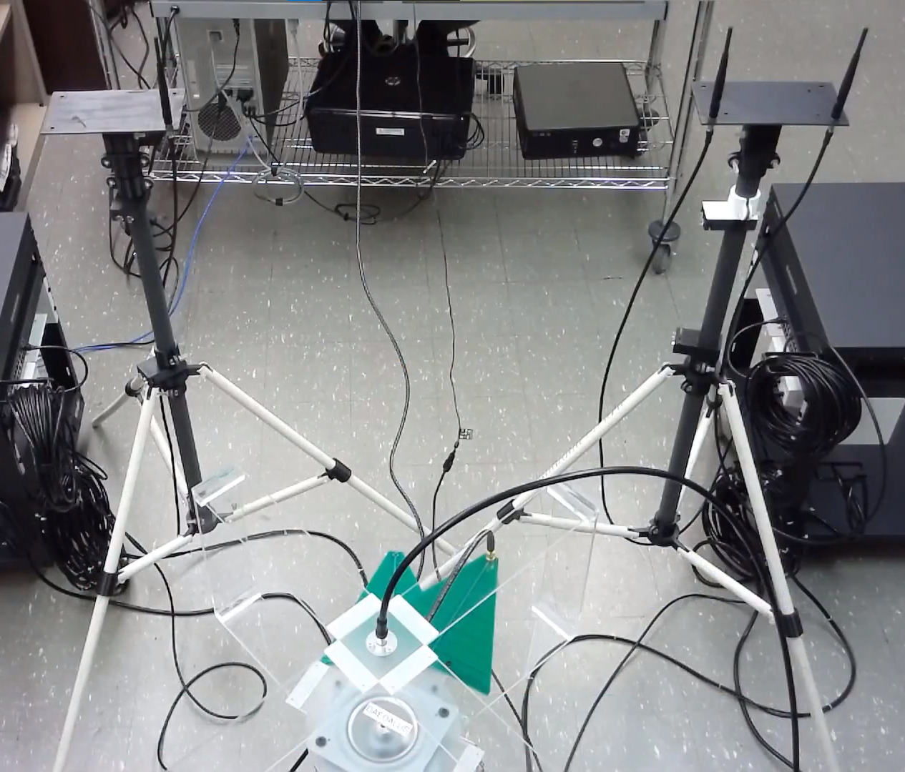

Being a part of Computer Engineering here at UH Manoa, meant I had to do projects (x96), the same as Electrical Engineers. I got into a group focused on Cyber Security and found what was offered interesting. Cyber security was not something I really put much thought in, and when the professor explained the aspects of it, I thought it was an engaging and important field. So, I decided to join the project as part of my x96 projects.

In wireless communications, being able to privately communicate between two points is important. There are various methods for RF communications that attempt to prevent an eavesdropper from decrypting the message. The method that my group came with is iJam with channel randomization, where it utilizes both methods of friendly jamming, and channel randomization to prevent an eavesdropping from decrypting what is sent. We are using a program to interface with our hardware in order to change the parameters as needed for our experiment. I was tasked to help with creating the GUI used to run the experiment. 

So far we were able to get some preliminary results and present our findings in WiSec 2020, and can be seen in the video listed below. This is a cool event with various cyber security related topics and being a part of it was a memorable experience for me. Currently there are some kinks that are needed to be worked out, as well as different scenarios to be tested. We hope to further our research and test this method in various scenarios to determine its viability.

Video: <a href="https://www.youtube.com/watch?v=lMRiCmiHmb0&list=PL4FCce8hBdnKuFYGLkbFG4il84N6nVk3P&index=2&t=15s"><i class="large youtube icon "></i>iJam with Channel Randomization</a>

