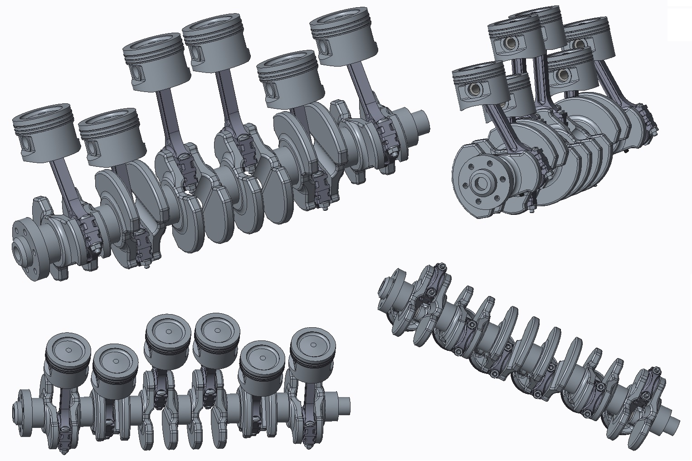

  

 With the Creo product development software, users can create their product from concept to digital prototype and do so with efficiency, and accuracy. 
       
       What did I like best?

One of the most powerful 3D CAD packages available. Does an excellent job with large assemblies and complicated models (surfaces, sheet metal, etc.). Very good integration with many add-in options (ANSYS, PDM, Keyshot, etc.). The ribbon interface is vastly improved over prior versions. Drawing mode has been greatly improved over prior versions: it no longer feels like an afterthought. There are plenty of options for file interchange and conversion.

      What did I dislike?

The interface is still a mixed bag of the terribly outdated and ineffective menu manager and the new ribbon menu interface. Selection filter still has a mind of its own: defaults to selecting an edge or point deeper in the part instead of the front surface that you are hovering on. Some features could be incredibly useful if they were not glitchy: pattern by points frequently exhibits odd behavior with extrude directions that usually renders it unusable.

    Recommendations to others considering the product

Creo is the best choice for 3D modeling in a large corporation with experiences users. There are other options for beginning CAD users that would likely be easier to learn, but I do not know of a program that has the complete package of operation that Creo has.

You can learn more about the software I use here [here](http://www.ptc.com/cad/creo).

