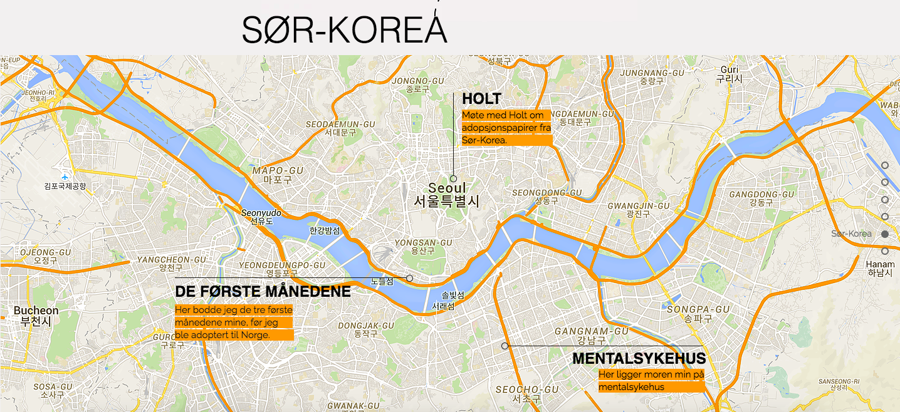

 

Juliepaasporet (Julie on the track) is a exam schoolproject, which was developed in cooperation with a girl who are adopted from South-Korea. The project was built in a design course, and carried out in teams.

The main purpose with making the webpage was to gain experience in prosject planning and concept development. I learned alot about evaluation, design processes and testing methods in this course. 

We used a web bulider called wix. From this project, I gained experience with the pre-made web builder and to understand the positive and negative sides of not programming the website itself. By using the default template, it resticted some of the things we wanted to accomplish. 
