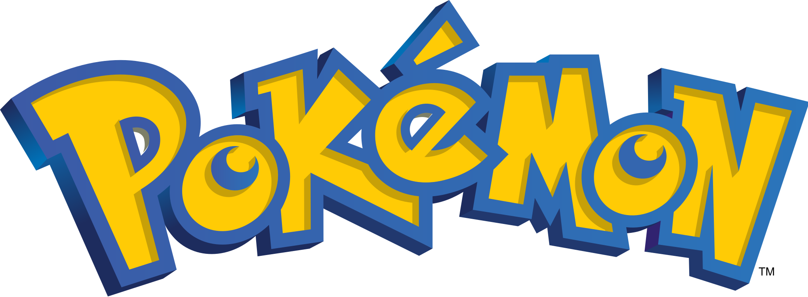

This is a program that I created for ICS 212. The point of making this program was to understand how polymorphism work in c++. I was already exposed to this concept in Java, but there are large differences when working with c++. This is one of the first experiences I had with the programming language c++. The program stores data for Pokemon using a vector and a map, and prints it out. Each specific Pokemon has their own class that extends a Pokemon class. This is where we got to override methods so we could use polymorphism. 

I learned a lot about c++ when creating this program, which is why I chose to include it. This was a hard program for me to write, even though there was no complex algorithms or hard concepts involved. It was hard for me because I did not have much previous knowledge about c++, and reading resources about this language online can be confusing at times. Writing this program made me appreciate having less features in c. I learned a lot about c++, but most importantly that it is not a language for me.

You can see the code in my repository [Koby Villalobos's GitHub](https://github.com/koby-villalobos/pokemon).
