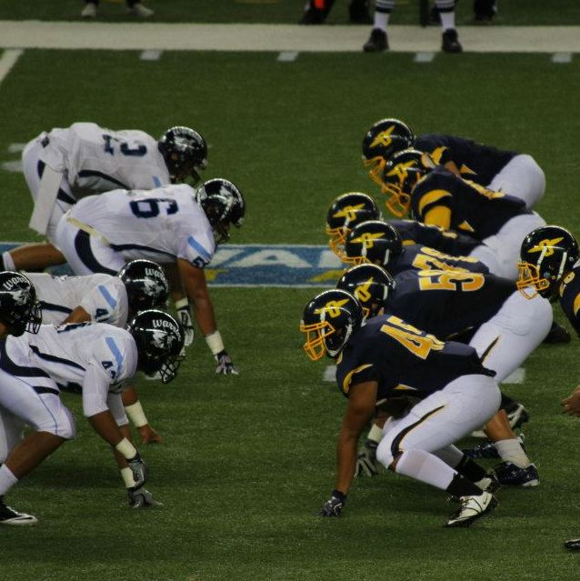

Not exactly a project, but being a part of a competitive football team taught me a lot about working and growing as a team, as well as self discipline. I was a part of my high schools varsity football team where we practiced everyday, sometimes twice a day. I was the right tackle on the offensive line. The role of the offensive line is to protect the quarterback from the opposing team. In order to accomplish a such a task with only 5 guys is nearly impossible without communication and teamwork. Depending on how the defending team is aligned, last minute adjustments sometimes need to be made. Some plays required to block a certain direction, so if one person messes up, the whole play is ruined. In order for a football team to be successful, everyone on the team needs to be doing their job, or everything falls apart. In order to make sure I was doing my job, I needed to develop self discipline. It would have been easy to fake my way through practice, or to never go to the gym to get stronger, however, I knew my teammates were relying on me and I knew they were out there working just as hard, if not harder than me. We all pushed each other to become better, while working toward a common goal. This relates to software engineering, often times while working at a software company, people work in teams to accomplish a single task. In order for a team to work successfully, everyone must work together and have self discipline to complete their work on time and with excellence. 
