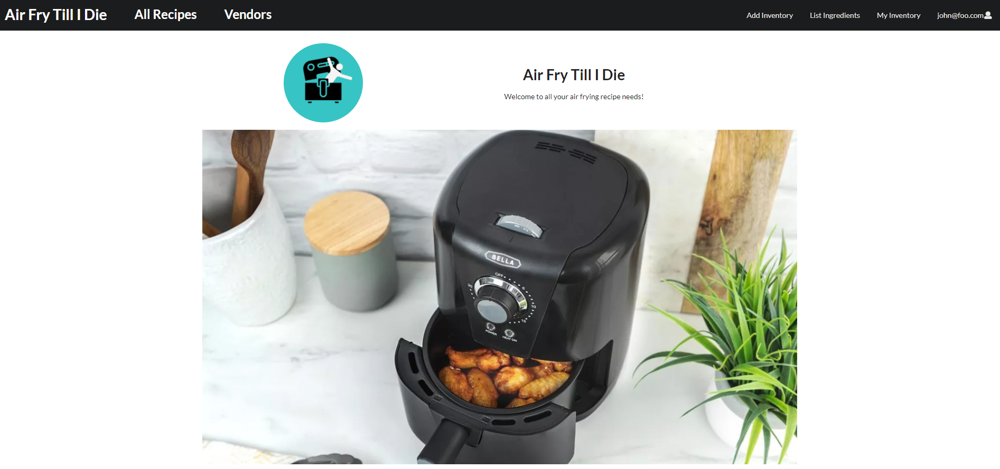
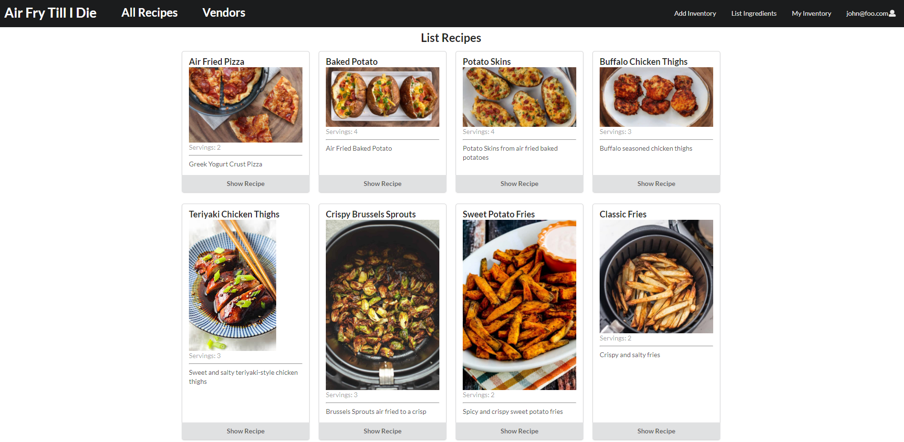

For the final project of ICS 314, I worked with a team to create a website. The website that we decided to create is an air frying recipe website. It allows for users to view recipes that they could create with an air fryer. It also gives registered users a way of keep track of their pantry through an inventory page. We are still looking to improve the webpage to provide additional functionalities.

We used a provided website template and modified it in order to meet our needs. I was tasked with implementing the Recipe and Vendor page, and am happy to say I created the website's icon. I had the Recipe page take in a recipe collection and takes each recipe and displays them in a card, where a user can click on to display more information about the recipe. Then for the Vendors page, I made it display various stores located close to UH Manoa, and again users can click on each one to get information about the products and their prices from each store.

So far we were able to get some a good layout of the website, but there are still improvements that can be made. We are looking to add a way to search through the recipes, and a way to recommend recipes based on a user's inventory. We hope to implement these features in the near future.

Github: <a href="https://github.com/Air-Fry-Till-I-Die"><i class="large github icon "></i>Air Fry Till I Die</a>
Website: <a href="https://aftid.xyz">Air Fry Till I Die</a>
