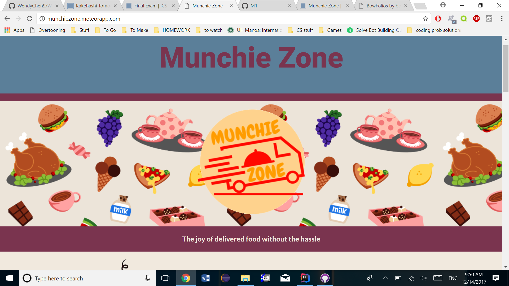
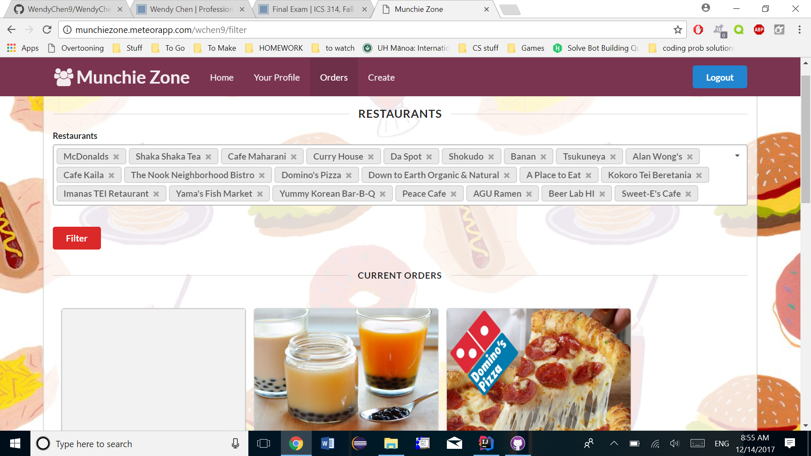
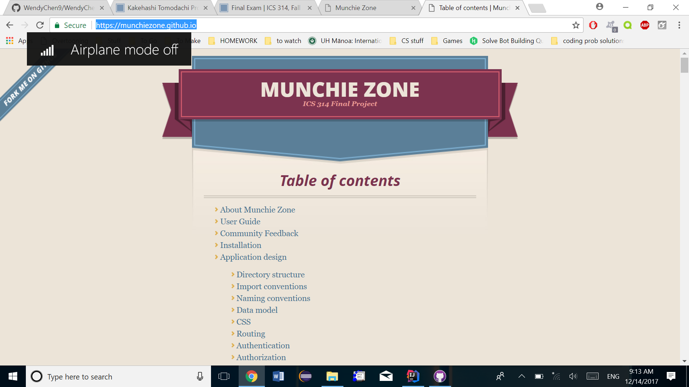

## The Project

Munchie Zone is a website developed for University of Hawaii students. Since delivery apps like Bite Squad or Uber Eats often charge more for individual orders, the purpose of Munchie Zone is to gather students, who would want to order from the same place, to avoid such fees. Users can customize their profile and input their favorite restaurants, doing so allows the user to see if any current orders contain their favorite restaurant. This would show on the Home page and Orders page of the site. The orders are shown using cards, with information like the picture of the restaurant, the restaurant name, the pick up location, diet type, and the pick up time. Users can add to the order by pressing the button on the order card, which leads them to the edit page, where users can input their order. The current orders page also allows users to filter the current orders based off of restaurants. 

## The Work

At the end of our Software Engineering course, we had a final group project due. The goal was to create a functional website that utilizes all the skills and information that we learned throughout the course. Not only did we have to create a functioning website, but we also had to document the milestones we achieved in a GitHub page, which can be viewed <a href="https://munchiezone.github.io/">here.</a>
 
Each milestone in the project contained multiple issues to work on so that the website could be slowly completed, but everyone in the group helped everyone else's issues if any problems arose. The first milestone was the aesthetics of the website, so mockup web pages were created so that the group could get an idea of what the website would look like before we began implementing backend code. 

The Milestone 1 issue that I was designated for was to work on the landing page for munchie zone. I used the professor's example project <a href="https://bowfolios.github.io/">Bowfolios</a>as a template. The color scheme was inspired by the Munchie Zone github.io page. The goal of the landing page was to entice new users to try out the website. The landing page explains the purpose of the website and how to use the website, then leads the user to login. Unfortunately, the website can only be accessed by authorized University of Hawaii at Manoa accounts because the website is for testing, not for actual use.

Milestone 2 included issues that involved backend coding for the project to give the website functionality. For this milestone, I had implemented an Order collection that stores all orders created. Then I created the create orders page so users could make an order and have the order be added to the Order collection successfully. I also participated in building a functional page that edits orders, so that when an Order card was clicked, the site would go to the edit page for that specific order, in which all information regarding the order in the form was filled out. Also, I was made it so the submit button successfully changes the current order to reflect an editted order. 

## The Result

This group project allowed me to apply the skills I learned in the course to a single application. I was able to work together in a group to produce a functioning website using HTML, Javascript, Meteor, and MongoDB. I believe the most important aspect that I got out of thie assignment was better problem solving skills. Since my group members had some problems in figuring out backend processes of the website for their issues, I was able to analyze the code closely to figure out the problem and successfully solve the problem. I was also able to learn about project management, to divide a big project into smaller issues and to delegate each issue to each issue to each person so that each person has the same total amount of difficulty. The use of GitHub in the group project was vital as well, to avoid any clashing code, GitHub allowed the team to organize the code properly when branching off of the master branch and merging branches. Doing so also allowed us to keep track of functional code so that we could backtrack if anything went wrong. Overall, I learned a lot from this project that could apply to future projects, such as time management, teamwork, and coding.
