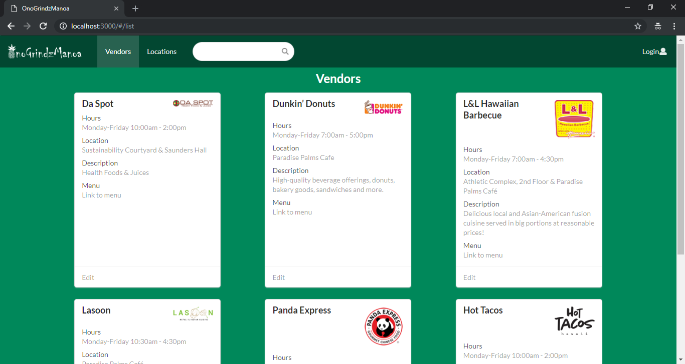
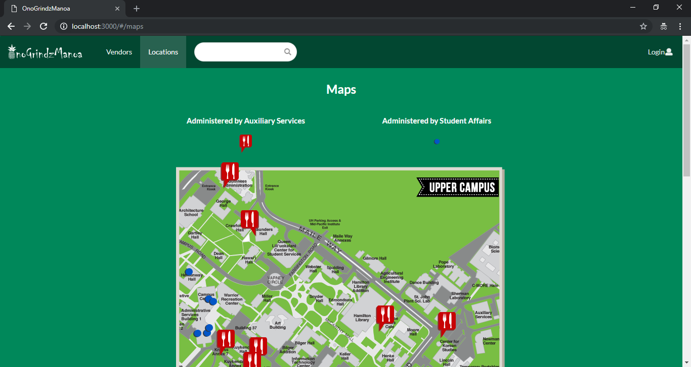

    During my fall semester of 2018, I had the opportunity to work on a group software engineering project for my ICS314 course. We used many new technologies we had been working with throughout the semester including Meteor, MongoDB, and React JS with semantic UI. We had quite a bit of freedom in choosing the main subject of our project, so we decided to try and solve an everyday issue students at the University of Hawaii Manoa might experience, using software engineering.

    A mutual problem I and my three group members shared was finding food we wanted to eat both on and near campus. To solve this issue, we thought to create OnoGrindzManoa, a custom web application where hungry students can quickly search for nearby food with ease. Customers are able to browse through our extensive list of vendors, receiving additional information about specials offers, prices, locations, and hours of operation.
    

  

    For our first milestone, our goal was to make mock-ups of all of the pages we wanted and to create our basic project structure. We weren't concerned with implementation of functionality during this time. I was in charge of creating a mock-up for the vendor page where all of the vendors and their information would be listed.
  
    For our second milestone our goal was to implement functionality for everything we had made mock-ups for. For me, this meant setting up a new collection and schema via MongoDB to hold all of our vendor information. One issue I came across was figuring out how to store menu information. I knew storing an entire menu as a string wasn't practical, so I ended up storing URL's to the vendor's own provided menu. This also made it easier for the vendors to maintain their online menu as they will no longer have to update their own website, as well as OnoGrindzManoa. In order to keep normal users from editing vendor information, I implemented multiple login roles: user, vendor, and admin. This makes it so users who make an account cannot edit any vendor information. In order to make a vendor account, owners can contact and OnoGrindzManoa Admin and only they can create vendor accounts.

    Our third milestone was similar to our first. Now that we had a working base application, we were now looking to add new features and continue to build our app into something people might actually use. One of the main ideas we wanted to implement was a campus map with the locations of each vendor pinned down. Clicking on a pin would display a card of additional information, enabling users to quickly and easily search through nearby food choices. Unfortunately we were unable to complete with portion of our project due to time constraints, however a mock-up of how it would have looked is available.

    Overall, this project was an excellent experience and I feel I learned a lot about both software engineering and working on a development team.

  

Source: <a href="http://onogrindzmanoa.meteorapp.com/#/">OnoGrindzManoa</a>

